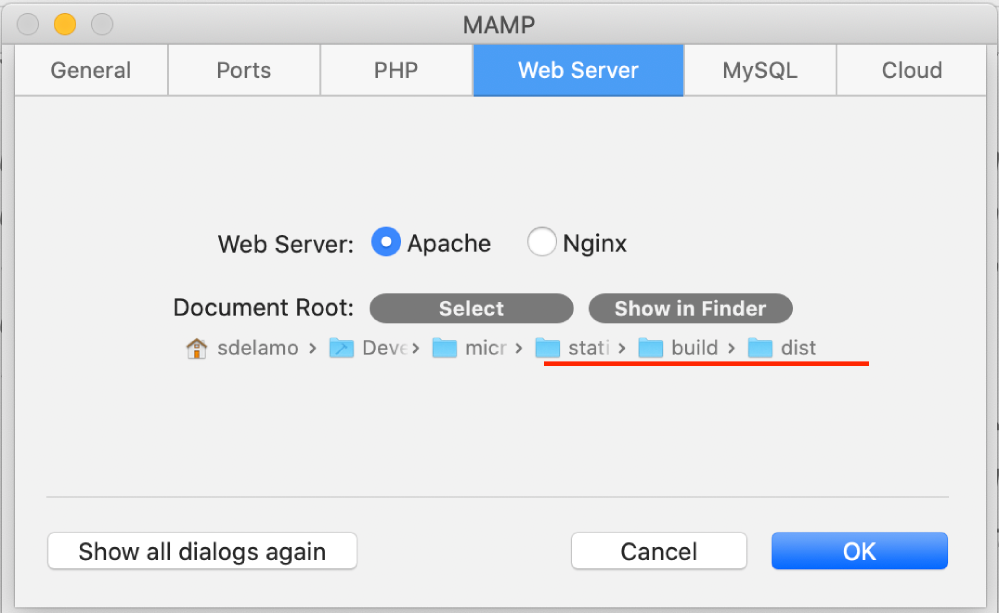
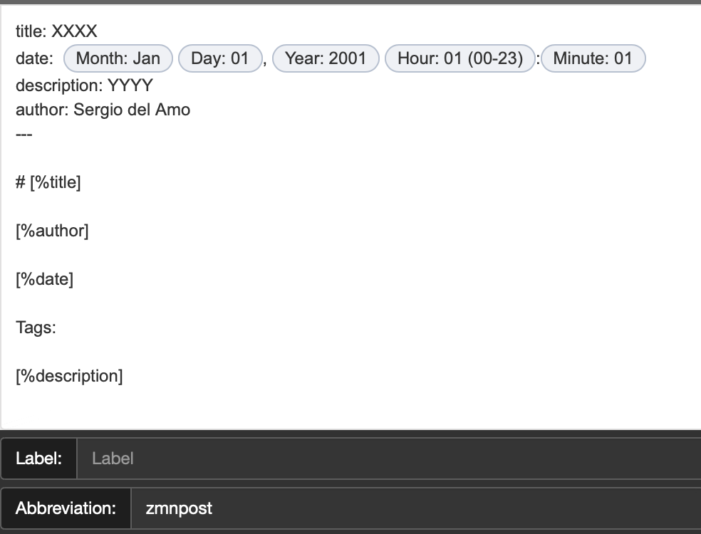

# Grails Website - An amazing website

[](https://github.com/grails/grails-static-website/actions)

This project builds the Grails website. A static website build with [Gradle](https://gradle.org). It uses a Gradle Plugin whose sources can be found at `buildSrc`. 

Gradle tasks use `grails` group. 

You can get more info by running: 

```
  % ./gradlew tasks --group=grails
 
 > Task :tasks
 
 ------------------------------------------------------------
 Tasks runnable from root project
 ------------------------------------------------------------
 
 Grails tasks
 ------------
 buildGuides - Build guides website - generates guides pages, copies assets and generates a sitemap
 copyAssets - Copies css, js, fonts and images from the assets folder to the dist folder
 genDocs - Generates documentation HTML page - build/temp/documentation.html
 genFaq - Generates FAQ HTML - build/temp/faq.html 
 genGuides - Generates guides home, tags and categories HTML pages - build/temp/index.html
 genProfiles - Generates profiles HTML page - build/temp/profiles.html
 genSitemap - Generates build/dist/sitemap.xml with every page in the site
 renderBlog - Renders Markdown posts (posts/*.md) into HTML pages (dist/blog/*.html). It generates tag pages. Generates RSS feed. Posts with future dates are not generated.
 renderSite - Build Micronaut website - generates pages with HTML entries in pages and build/temp, renders blog and RSS feed, copies assets and generates a sitemap
 
 To see all tasks and more detail, run gradlew tasks --all
 
 To see more detail about a task, run gradlew help --task <task>
 
 BUILD SUCCESSFUL in 558ms
 1 actionable task: 1 executed
```

## Generating the MAIN site

[https://grails.org](https://grails.org)

```bash
./gradlew build --console=plain
```

The output can be found in the `build/dist` directory.

## Generating the GUIDES site

[https://guides.grails.org](http://guides.grails.org)

```bash
./gradlew buildGuide --console=plain

```
The output can be found in the `build/dist` directory.

## Running the website locally

The easiest way to work locally is to generate the site and setup your Webserver to serve build/dist. 

For example with [MAMP](https://www.mamp.info/en/mamp/): 



You can also use Python to serve the directory:

```
python3 -m http.server 8080 --directory build/dist
```

## Blog Posts

### Posts Location

Write blog posts in markdown at `posts` folder.

### Blog post Metadata

A post supports metadata at the beginning of the document. You can use it store information (title, description, publication date) about your blog posts. 

Metadata must be separated from the rest of the document by three dashes.

You can use the metadata in the text by putting it in brackets adding a % sign.

A typical blog post will look like: 

```markdown
---
title: Deploying Grails 3.1 Applications to JBoss 6.4 EAP
date: May 26, 2016   
description: Learn necessary configuration differences to deploy Grails 3.1 applications to JBoss 6.4 EAP
author: Graeme Rocher
image: 2016-05-26.jpg
---

# [%title]

[%author]

[%date] 

We had [previously](http://grails.io/post/142674392718/deploying-grails-3-to-wildfly-10) described how to deploy Grails 3.1 applications to WildFly 10, which is where all of the "cutting edge" work happens in the JBoss world.

The process to deploy Grails 3.1 applications to JBoss 6.4 EAP is largely similar, with some minor configuration differences.
```

#### Text Expander snippets

If you write often to Micronaut's blog, we recommend you to create a [Text Expander](https://textexpander.com) snippet:

 


#### Title Metadata

`title` tag is used as the window title, the card title, blog post main header and also in twitter cards.

#### Description Metadata

Description metadata is used as HTML meta description tag, and in twitter cards.

#### Date Metadata

Date is used to for publication date. It is used to order to blog posts. It is displayed in the UI and in the RSS feed.

Date can be expressed in `MMM d, yyyy`

```markdown
---
...
..
.
date: April 9, 2020  
---

```

or `MMM d, yyyy HH:mm`
 
```markdown
---
...
..
.
date: April 9, 2020 09:00
---

```

**To Schedule tasks use a date in the future. Github Action runs daily and will publish scheduled posts.**

#### Blog post background

For Blog post background images usage image metadata. 

```markdown
---
...
..
.
image: 2018-05-23.jpg
---
```

Place the images at `assets/bgimages`


### Tags

To add tags just preffix them with `#`:

Example:

```markdown
Tags: #angular
```

**Webinars on-demand recordings should be tagged with `webinar`**

Release announcements should be tagged with `release`. 

Check the [list of tags](https://grails.org/blog/index.html) and try to reuse them. 

#### Code Highlighting

If your blog post, contains code samples add the following metadata:

```markdown
---
...
..
.
CSS: [%url]/stylesheets/prism.css
JAVASCRIPT: [%url]/javascripts/prism.js
---

# [%title]

```

#### Video

Use the `video` metadata to embed a Video. 

Currently, the plugin supports youtube videos. Use a link which starts with `https://www.youtube.com/watch?v=` such as `https://www.youtube.com/watch?v=RtjSqRZ_md4`

Example: 

```markdown
---
title: JSON Views 
date: April 1, 2016   
description: Jeff Scott Brown uses music examples to probe JSON views.
author: Jeff Scott Brown
image: 2016-04-01-2.jpg
video: https://www.youtube.com/watch?v=XnRNfDGkBVg
---

# [%title]

[%author]

[%date] 

Tags: 

[%description]
```


## Assets (Fonts, Stylesheets, Images, Javascripts)

Assets used in the website can be found under `assets`. 

## What to change when a new release is published.

Please, modify `conf/releases.yml`
