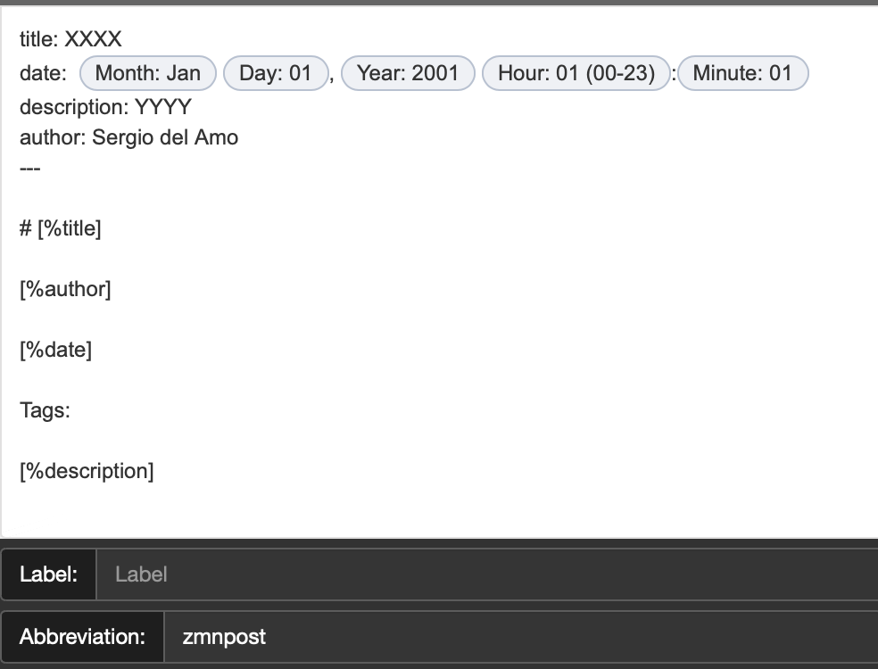

<!--
SPDX-License-Identifier: Apache-2.0

Licensed under the Apache License, Version 2.0 (the "License");
you may not use this file except in compliance with the License.
You may obtain a copy of the License at

    https://www.apache.org/licenses/LICENSE-2.0

Unless required by applicable law or agreed to in writing, software
distributed under the License is distributed on an "AS IS" BASIS,
WITHOUT WARRANTIES OR CONDITIONS OF ANY KIND, either express or implied.
See the License for the specific language governing permissions and
limitations under the License.
-->

# Grails Website

[](https://github.com/apache/grails-static-website/actions)

Source for the Apache Grails website at [https://grails.apache.org/](https://grails.apache.org/) and the guides site at [https://grails.apache.org/guides/](https://grails.apache.org/guides/). Built as a static site with [Gradle](https://gradle.org); the build logic lives in [`buildSrc/`](buildSrc/).

The cron-driven [`publish.yml`](.github/workflows/publish.yml) workflow builds this repository and pushes the result to the [`asf-site-production` branch on `apache/grails-website`](https://github.com/apache/grails-website/tree/asf-site-production), which Apache Infra mirrors to `grails.apache.org`. Concurrent documentation pushes from Grails Core are retried with the same non-fast-forward rebase as [`deploy-github-pages` PR #110](https://github.com/apache/grails-github-actions/pull/110).

The legacy `https://guides.grails.org/` host is kept alive serving meta-refresh redirects to the new canonical URLs.

## Repository layout

| Path | What lives here |
|---|---|
| `pages/` | Hand-authored HTML pages on the main site (community, download, FAQ, etc.) |
| `posts/` | Blog posts in Markdown |
| `assets/` | CSS, JS, fonts, images for the main site |
| `templates/` | HTML chrome shared across the main site and guide pages |
| `conf/` | Site configuration: `guides.yml` (guide registry), `releases.yml` (Grails versions), `csp-allowlist.yml`, `legacy-guide-paths.txt` (redirect manifest input) |
| `guides/` | Vendored guide content - one subdirectory per guide, then per Grails major version (see [Authoring a Guide](#authoring-a-guide)) |
| `buildSrc/` | Gradle plugin (`website.gradle.GrailsWebsitePlugin`) and all custom tasks |
| `scripts/` | Reserved for migration helpers; see [Appendix G of the migration plan](https://github.com/apache/grails-static-website/issues/354) - everything operational is a Gradle task |

## Building locally

Tasks use the `grails website` group:

```bash
./gradlew tasks --group="grails website"
```

### Main site

[https://grails.apache.org](https://grails.apache.org)

```bash
./gradlew build --console=plain
```

Output lands in `build/dist/`.

### Guides site

[https://grails.apache.org/guides/](https://grails.apache.org/guides/)

```bash
./gradlew buildGuides --console=plain
```

This is the aggregate task. To render a single guide-version while iterating on its source:

```bash
./gradlew renderGuide_<name>_<version> --console=plain
# e.g. ./gradlew renderGuide_creating-your-first-grails-app_6
```

To check `conf/guides.yml` against the schema:

```bash
./gradlew validateGuides -PvalidationMode=both
```

To run the full guide verification harness (warning gate, link crawl, CSP scan, acceptance report):

```bash
./gradlew verifyAllGuides
```

### Local link rewriting

The build emits absolute URLs to `https://grails.apache.org/`. For local preview, point links at your local webserver:

```bash
export GRAILS_WS_URL=http://127.0.0.1:8000
```

## Running the website locally

Generate the site, then serve `build/dist/` with any static-file server.

### Testing Algolia search locally

The local search page can query the deployed `grails_site_search` index using
the public Algolia credentials. Do not use the admin API key here. Set the
application ID and search-only key before generating the site:

```bash
export ALGOLIA_APP_ID=your-app-id
export ALGOLIA_SEARCH_API_KEY=your-search-only-key
export GRAILS_WS_URL=http://127.0.0.1:8000
./gradlew clean build --console=plain
```

Then serve the generated site and open
[`http://127.0.0.1:8000/search.html`](http://127.0.0.1:8000/search.html):

```bash
jwebserver -d "$(pwd)/build/dist"
```

The `GRAILS_WS_URL` protocol and port must match the server you use. For
example, use `http://127.0.0.1:8080` with
`python3 -m http.server 8080 --directory build/dist`, not an `https://` URL.
The page uses the live Algolia index, but the site itself is served locally.
Search result links point to the published Grails website unless the indexed
URLs are changed separately.

### Using jwebserver (JDK 19+)

JDK 19+ ships with a built-in static-file server called [`jwebserver`](https://docs.oracle.com/en/java/javase/25/docs/specs/man/jwebserver.html):

```bash
$ jwebserver -d "$(pwd)/build/dist"
Binding to loopback by default. For all interfaces use "-b 0.0.0.0" or "-b ::".
Serving /home/user/grails-static-website/build/dist and subdirectories on 127.0.0.1 port 8000
URL http://127.0.0.1:8000/
```

### Using Python

```bash
python3 -m http.server 8080 --directory build/dist
```

### Using npm + live-server

For live auto-reload, install [`live-server`](https://www.npmjs.com/package/live-server):

```bash
npm install -g live-server
live-server build/dist
```

Combine with continuous Gradle builds in a separate shell for full reloading:

```bash
./gradlew build --continuous
```

## Authoring a Guide

A guide is the rendered form of an AsciiDoc source tree under [`guides/<name>/v<N>/guide/`](guides/) plus a single entry in [`conf/guides.yml`](conf/guides.yml). The registry entry holds **all** of the per-version metadata, including the table of contents.

### Two flavours

Most of the time it's just narrative + inline code blocks. If you also want readers to be able to `git clone` a runnable sample app, host it on the [`grails-guides` org](https://github.com/grails-guides) and link to it from the registry entry's `sampleRef`.

| Flavour | What it adds | External `grails-guides/<name>` repo? |
|---|---|---|
| **Documentation** | Pure narrative with inline `[source,groovy]` code blocks. | No |
| **Documentation + sample app** | Same narrative, plus `include::../snippets/<path>[]` directives that pull verbatim source from a vendored `snippets/` tree. The matching upstream repo (with `initial/` and optionally `complete/`) lives on the `grails-guides` org so readers can clone and run it. | Yes |

If your guide needs an upstream repo, see [Requesting a sample-app repository](#requesting-a-sample-app-repository) - PMC-provisioned.

### Source layout per guide

Every guide-version lives at `guides/<name>/v<N>/`:

```
guides/<name>/v<N>/
├── guide/
│   └── <chapter>.adoc    # one file per chapter (referenced by the registry's toc)
└── snippets/             # OPTIONAL: vendored source that include:: directives reference
```

That's it. No per-guide YAML files. All metadata - title, subtitle, authors, tags, sample-app pointer, **and the chapter ordering** - lives in one place: the entry in `conf/guides.yml`.

### Registering the guide in `conf/guides.yml`

Add an entry to the top-level `guides:` list. Each `versions[<N>]` block carries the `toc:` mapping that drives the rendered table of contents (top-level keys are chapter slugs, matching `<chapter>.adoc` filenames; their `title:` values are the chapter labels; sibling keys are sub-section anchor IDs):

```yaml
- name: 'my-guide-name'
  title: 'My Guide Title'
  subtitle: 'A short subtitle'
  authors: ['Your Name']
  category: 'Some Category'
  publicationDate: '2026-05-02'
  versions:
    '8':
      sourcePath: guides/my-guide-name/v8
      tags: ['grails8', 'topic']
      toc:
        gettingStarted:
          title: Getting Started
          requirements: What you will need
        writingTheApp:
          title: Writing the App
        helpWithGrails:
          title: Do you need help with Grails?
```

Sample-app flavour adds `sampleRef`:

```yaml
      sampleRef:
        repo: 'grails-guides/my-guide-name'
        branch: 'grails8'
```

`sampleRef` drives the "Get the Code" sidebar on the rendered page. `repo` and `branch` are the only fields.

### Step-by-step

1. Create `guides/<name>/v<N>/guide/` (and `snippets/` if your guide uses `include::../snippets/...` directives).
2. Write the chapter `.adoc` files. Inline `[source,groovy]` blocks cover most code; long verbatim source goes in `snippets/` and is referenced via `include::../snippets/<path>[]`.
3. Add the registry entry to `conf/guides.yml`, including the `toc:` block.
4. (Sample-app flavour) Push your `initial/` (and optionally `complete/`) tree to `grails-guides/<name>` on the matching `grails<N>` branch.
5. Validate locally: `./gradlew validateGuides -PvalidationMode=both`.
6. Render locally: `./gradlew renderGuide_<safeName>_<N>` (underscores in `<safeName>`) and open `build/dist/guides/<name>/<N>/guide/index.html`.
7. Open a PR against this repository.

### Worked example: grails-fields-custom-widgets-and-wrappers v8

The most recent guide on the site, [grails-fields-custom-widgets-and-wrappers v8](https://grails.apache.org/guides/grails-fields-custom-widgets-and-wrappers/8/guide/index.html), is a sample-app-flavour Grails 8 guide and a useful concrete reference for new authors. It exercises every part of the workflow described above:

- **Source tree:** [`guides/grails-fields-custom-widgets-and-wrappers/v8/`](guides/grails-fields-custom-widgets-and-wrappers/v8/) - 30+ chapter `.adoc` files under `guide/`, vendored Groovy + GSP source under `snippets/`.
- **Registry entry:** see the `grails-fields-custom-widgets-and-wrappers` block in [`conf/guides.yml`](conf/guides.yml) - shows the full `versions['8']` block with `sourcePath`, `tags`, `sampleRef` (`repo` + `branch`), and the inline `toc:` mapping that drives the table of contents.
- **Upstream sample app:** [`grails-guides/grails-fields-custom-widgets-and-wrappers`](https://github.com/grails-guides/grails-fields-custom-widgets-and-wrappers) on the `grails8` branch contains the matching `initial/` and `complete/` trees that the `snippets/` directory was vendored from.
- **Cross-reference:** chapters reference vendored source via `include::../snippets/<path>[]` directives - see [`guide/manyToOneWidget.adoc`](guides/grails-fields-custom-widgets-and-wrappers/v8/guide/manyToOneWidget.adoc) for a representative example that pulls a `_widget.gsp` template into the rendered page.

Reading the v8 guide's source alongside its rendered output is the fastest way to see how `conf/guides.yml`, the `guide/` AsciiDoc, and the vendored `snippets/` come together.

### Requesting a sample-app repository

Repositories under [`https://github.com/grails-guides`](https://github.com/grails-guides) are owned and provisioned by the Apache Grails PMC. Sample-app flavour guides need one of these repositories before the guide can ship.

Contact the PMC via the [community page](https://grails.apache.org/community.html).

A PMC member with org-admin access on `grails-guides` will create the repository, set the default branch (the latest `grails<N>` you target). Then you will create a PR from your personal GitHub fork.

### Local validation checklist

Before opening the PR:

```bash
# Schema check on conf/guides.yml
./gradlew validateGuides -PvalidationMode=both

# Single-guide render (faster than buildGuides)
./gradlew renderGuide_<name>_<version>

# Full corpus + verification harness
./gradlew buildAllGuides
./gradlew verifyAllGuides
```

Open the rendered HTML directly in a browser - relative CSS makes file:// URLs work.

## Blog Posts

### Posts location

Write blog posts in Markdown under [`posts/`](posts/).

### Blog post metadata

A post supports metadata at the top of the document. Use it for title, description, publication date, and other display fields. Metadata is separated from the body by three dashes, and the metadata values can be referenced in the body via `[%fieldname]`.

A typical blog post looks like:

```markdown
---
title: Deploying Grails 3.1 Applications to JBoss 6.4 EAP
date: May 26, 2016
description: Learn necessary configuration differences to deploy Grails 3.1 applications to JBoss 6.4 EAP
author: Graeme Rocher
image: 2016-05-26.jpg
---

# [%title]

[%author]

[%date]

We had [previously](https://grails.io/post/142674392718/deploying-grails-3-to-wildfly-10) described how to deploy Grails 3.1 applications to WildFly 10, which is where all of the "cutting edge" work happens in the JBoss world.

The process to deploy Grails 3.1 applications to JBoss 6.4 EAP is largely similar, with some minor configuration differences.
```

#### Text Expander snippets

If you write to the Grails blog frequently, consider creating a [Text Expander](https://textexpander.com) snippet:



#### `title`

Used as the window title, the card title, the blog post main header, and in social cards.

#### `description`

Used as the HTML meta description tag and in social cards.

#### `date`

Publication date - drives ordering in the blog index, the displayed date in the UI, and the RSS feed entry date. Two accepted formats:

- `MMM d, yyyy` (e.g. `April 9, 2020`)
- `MMM d, yyyy HH:mm` (e.g. `April 9, 2020 09:00`)

**Posts dated in the future are scheduled.** The cron-driven publish workflow runs daily and ships scheduled posts when their date arrives.

#### Background image

Reference a background image from `assets/bgimages/` via the `image` metadata key:

```markdown
---
image: 2018-05-23.jpg
---
```

Place the source files under [`assets/bgimages/`](assets/bgimages/).

### Tags

Prefix tags with `#`:

```markdown
Tags: #angular
```

- Webinar on-demand recordings should be tagged `webinar`.
- Release announcements should be tagged `release`.
- Check the [list of existing tags](https://grails.apache.org/blog/index.html) and reuse them where reasonable.

#### Code highlighting

If your post contains code samples, opt into the Prism highlighter via metadata:

```markdown
---
CSS: [%url]/stylesheets/prism.css
JAVASCRIPT: [%url]/javascripts/prism.js
---

# [%title]
```

#### Embedded video

Set the `video` metadata to embed a YouTube video. Use a URL of the form `https://www.youtube.com/watch?v=...`:

```markdown
---
title: JSON Views
date: April 1, 2016
description: Jeff Scott Brown uses music examples to probe JSON views.
author: Jeff Scott Brown
image: 2016-04-01-2.jpg
video: https://www.youtube.com/watch?v=XnRNfDGkBVg
---

# [%title]

[%author]

[%date]

Tags:

[%description]
```

## Recording a release

When a new Grails version is published, append it to [`conf/releases.yml`](conf/releases.yml) via the `recordRelease` Gradle task:

```bash
./gradlew recordRelease -PreleaseVersion=7.0.0
```

This is also wired into the [`release.yml`](.github/workflows/release.yml) workflow, which is invoked manually from the Actions tab with the version as input.

## Assets (fonts, stylesheets, images, JavaScript)

All static assets used by the main site live under [`assets/`](assets/). Assets used by the guides site live under [`guides/resources/`](guides/resources/).

## Contributing

For broader Grails contribution discussion and questions:

- [Community page](https://grails.apache.org/community.html)
- [Dev mailing list](https://lists.apache.org/list.html?dev@grails.apache.org)
- [Slack](https://slack.grails.org)

## Algolia Search

The site-wide search at [`/search.html`](https://grails.apache.org/search.html) uses the `grails_site_search` index in the project's Algolia application. The Guides catalogue and plugin portal retain their separate client-side filters.

The public search configuration is supplied to GitHub Actions through these repository variables:

```text
ALGOLIA_APP_ID
ALGOLIA_SEARCH_API_KEY
```

The indexing workflow uses the repository secret `ALGOLIA_WRITE_API_KEY`. This secret must never be placed in site assets or generated output.

To generate the local record export, including rendered topic Guides and the published User and API Documentation, run:

```bash
ALGOLIA_COLLECT_EXTERNAL_DOCUMENTATION=true ./gradlew clean exportAlgoliaIndex --console=plain
```

To upload the export manually, use the repository helper script. It prompts for any missing credentials without echoing the write key, and collects external documentation by default:

```bash
./etc/bin/upload-algolia-index.sh
```

The application ID can be supplied through the environment; the write key can remain an interactive prompt. Extra arguments are passed to Gradle:

```bash
export ALGOLIA_APP_ID=your-app-id
./etc/bin/upload-algolia-index.sh --stacktrace
```

Set `ALGOLIA_COLLECT_EXTERNAL_DOCUMENTATION=false` to upload only locally rendered website and Guide records.

The export distinguishes these content sources:

- `website`: main pages, blog posts, FAQ, and case studies
- `guides`: step-by-step topic and technology guides under `/guides/`
- `user-documentation`: Grails framework User Documentation under `/docs/<version>/guide/`
- `api`: Groovydoc/API Documentation under `/docs/<version>/api/`

User Documentation and API Documentation are collected from the published documentation site during indexing because they are not generated in this repository. The default collector indexes the latest stable version for each Grails major plus the latest current pre-release from `conf/releases.yml`; override the source URL with `ALGOLIA_DOCUMENTATION_BASE_URL` and selected versions with comma-separated `ALGOLIA_DOCUMENTATION_VERSIONS` when needed.
