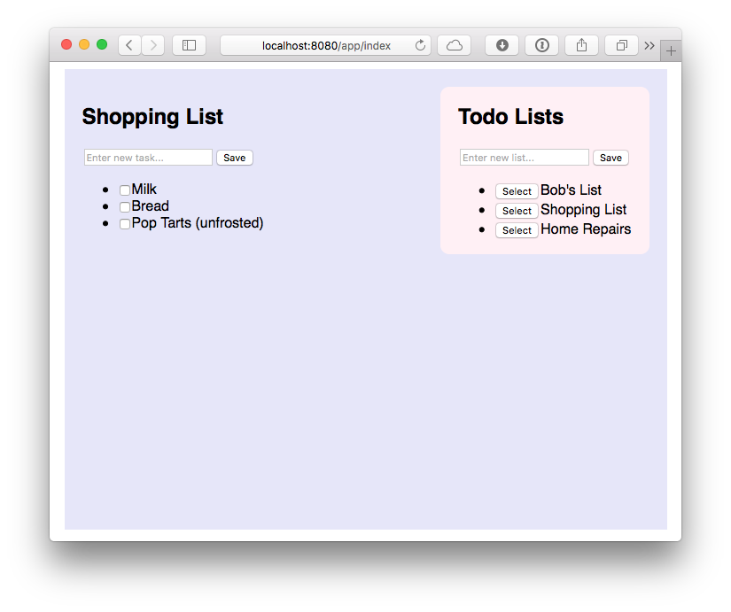

title: Using React with Grails
date: May 28, 2016  
description: React is a powerful and exciting library, and it’s a great choice for Grails applications.
author: Zachary Klein
image: 2016-05-28.jpg
CSS: [%url]/stylesheets/prism.css
JAVASCRIPT: [%url]/javascripts/prism.js
---

# [%title]

[%author]

[%date] 

Tags: #react #javascript #gradle

**React**, the JavaScript library from Facebook, has become a popular view technology for building dynamic, testable and performant user interfaces. While not a full-fledged framework like Angular or Ember, React’s focus on functional component-based views with no (or minimal) internal state makes it a great choice when building single page applications (SPA) or even dynamic subcomponents within a page-based application.

Because it doesn't make assumptions about data-flow or controller logic outside of rendering the view, React relies on the developer to either provide these features directly in JavaScript or use another framework as a backend to support the React-based UI.

It is this flexibility, in part, that makes React an appealing choice as a modern JavaScript view layer for **Grails** applications. Grails provides a robust backend built upon Spring Boot, GORM, and the Groovy programming language, as well as excellent support for generating restful endpoints that can be consumed by our React application. Since Grails 3 is also based upon Gradle, we can leverage [Gradle’s Node plugin](https://github.com/srs/gradle-node-plugin) to unify our build and testing pipeline for both Grails and React, without needing to complicate our deployment processes.

Finally, **JSX** (React's XML-like syntax for defining components and page markup) is a powerful and flexible way to create dynamic views. In the author's opinion, creating components in JSX is quite analogous to defining custom GSP tags in a Grails taglib: a function which receives state via props (GSP `attrs`) and typically (but not always) renders markup based on that state. In React's case, these components are re-rendered upon every change to the app's state, rather than being limited to page-load. This stateless component model should be understandable to Grails developers who have written [custom GSP tags](http://www.ociweb.com/resources/publications/sett/december-2015-custom-gsp-tags-grails-best-kept-secret/), and JSX takes this to the next level.

In this article, we'll demonstrate how to integrate React into a Grails 3 application, using some of Grail’s restful features to get up and running quickly. We’ll spend a bit of time getting our project set up, and get to know some of the players in a React codebase.

There are plenty of resources available to teach you React and restful API design, so I’m going to focus primarily on the “missing pieces” of combining React with a Grails application[1]. At the completion of this article, we'll list some resources to further your understanding of React. You'll be able to take this foundation and follow along with the same documentation, tutorials and other resources available to React developers.

## Building Our Foundation

Let’s start with a brand new Grails 3.1.6 application, using the default web profile:

```
    grails create-app com.ociweb.TodoList
```

Having run the `create-app` command, we already have a fully functioning backend application and server ready to go, and we can start up our app using the run-app command. View your new Grails application at [http://localhost:8080](http://localhost:8080/).

Let’s create our data model.

```
    grails create-domain-class com.ociweb.Todo
    grails create-domain-class com.ociweb.TodoList
```

```groovy
//grails-app/domain/com/ociweb/Todo.groovy
    package com.ociweb

    class Todo {

        String name

        static belongsTo = [todoList: TodoList]
    }
```

```groovy
//grails-app/domain/com/ociweb/TodoList.groovy
    package com.ociweb

    class TodoList {

        String name

        static hasMany = [ todos: Todo ]

        static constraints = {
            todos nullable: true
        }
    }
```

Now we have our domain model ready to go. By default Grails will provide us with an H2 database (in memory for development and test environments, as a file in production).

Of course Grails supports all the major databases, including MySQL, Postgres, Oracle, and even NoSQL data stores like **Mongo**. Thanks to the flexibility of GORM, changing datasources is as simple as adding a couple dependencies or lines of configuration.

Let’s switch to Mongo for this demonstration (this step is optional).

Specify the mongo plugin in your `build.gradle` file:

```groovy
//build.gradle

    buildscript {
        //…
        dependencies {
            //…
            classpath "org.grails.plugins:hibernate4:5.0.0.BUILD-SNAPSHOT"

    dependencies {
    		//…
        compile "org.grails.plugins:mongodb:5.0.0.BUILD-SNAPSHOT"
        compile "org.grails.plugins:hibernate4:5.0.0.BUILD-SNAPSHOT"
```

Now in our domain classes, add this static property to store the domain object in mongo: 

```groovy
    //grail-app/domain/com/ociweb/Todo.groovy & TodoList.groovy

//...
    static mapWith="mongo"
```

The plugin assumes you have mongodb installed and that mongod is running at port 27017; you can configure these to match your environment ([see the plugin documentation for details](http://gorm.grails.org/latest/mongodb/manual/index.html)).

## Defining Our API

Finally, we need to define a restful API for our React application.

API design is a broad subject and not in scope of this article. However, Grails gives us a jumpstart to getting our API off the ground, providing endpoints for standard CRUD operations with minimal configuration. This is done by declaring our domain classes as resources, either by marking with the `@Resource` annotation or specifying the resource class within our URLMappings.

Let's use the `@Resource` annotation for this example.

```groovy
//grails-app/domain/com/ociweb/Todo.groovy
    import grails.rest.Resource

    @Resource(uri='/api/todos', formats=['json'])
    class Todo {
      //...
```

```groovy
//grails-app/domain/com/ociweb/TodoList.groovy

    @Resource(uri='/api/todoList', formats=['json'])
    class TodoList {
      //...
```

Note that we specify the content-type we wish to expose - we’ll use JSON.

Finally, let’s add some initial data in `Bootstrap.groovy`:

```groovy
//grails-app/init/BootStrap.groovy

    import com.ociweb.*

    class BootStrap {

        def init = { servletContext ->

            if(!Todo.list()) {
                log.info "Creating todos..."
                def todoList = new TodoList(name: "Bob's List").save()

                [[name: "Task 1", todoList: todoList],
                 [name: "Task 2", todoList: todoList],
                 [name: "Task 3", todoList: todoList]].each { props ->
                    def todo = new Todo()
                    todo.properties = props
                    todo.save(flush: true)
                }

            }
        }
        def destroy = {
        }
    }
```

Restart the application to load the new data.

Now using a rest client application or a command-line utility like cURL, we can test drive our new API.

```
    ~ curl -i -H "Accept: application/json" localhost:8080/api/todos

    HTTP/1.1 200 OK
    Server: Apache-Coyote/1.1
    X-Application-Context: application:development
    Content-Type: application/json;charset=UTF-8
    Transfer-Encoding: chunked
    Date: Sun, 15 May 2016 06:03:56 GMT

    [{"id":1,"list":{"id":1},"name":"Task 1"},{"id":2,"list":{"id":1},"name":"Task 2"},
    {"id":3,"list":{"id":1},"name":"Task 3"}]
```

```
    ~ curl -i -H "Accept: application/json" localhost:8080/api/todoList/1

    HTTP/1.1 200 OK
    Server: Apache-Coyote/1.1
    X-Application-Context: application:development
    Content-Type: application/json;charset=UTF-8
    Transfer-Encoding: chunked
    Date: Sun, 15 May 2016 06:06:00 GMT

    {"id":1,"name":"Bob's List","todos":[{"id":3},{"id":1},{"id":2}]
    }
```

There you go, we have a fully functioning restful API, backed by Mongo, and my coffee isn’t even cold yet.

Now that we have our backend largely ready to go, we’re ready to set up React.

> Question: Why Do This?
> 
> Why not use separate backend and front-end apps? In a microservice architecture, the work we’ve done might be sufficient - we could now build a separate React/node-based front-end application independent of our Grails backend. This is a great strategy, and [Grails 3.1 ships with a profile](http://docs.grails.org/latest/guide/single.html#webApiAndAngularProfiles) tailored to this use case (web-api). Another option is to take advantage of Gradle multi-project builds, with separate projects for the backend and front-end. Both of these options require another server to run the React app.
> 
> In this article, however, we’re considering the use of React as the “view” (the V in MVC) in a standard Grails application. And although we’re sharing a project directory, the React code and Grails artifacts are independent, and will communicate at runtime via our restful API just as if they were separate apps. The only thing tying these two apps together is the same Gradle build, which gives us the benefits described earlier in the article (in fact, it would be quite easy to split out the React app in future by simply moving the `src/main/js` and `src/test/js` directories into their own project, and configuring up a new server).
> 
> There’s many situations where a team may want to bring React into a Grails application, and it can be done in a way that allows for full developer productivity for both Grails and Node/React developers. Read on to see how!

## Upgrading Our Build

React is most commonly used in combination with [node.js](https://nodejs.org/), and even if you aren’t intending to use node in particular, it still makes sense to have it installed if you intend to do any serious work with a Javascript library like React.

The reason? You will use `npm` (which most surely [does _not_ stand for Node Package Manager](https://www.quora.com/I-keep-hearing-NPM-doesnt-stand-for-Node-Package-Manager-what-does-it-stand-for)) to download and install React and any other libraries you choose to use alongside it. `npm` can also be used to run scripts to build and test your React code, and it is the “handle” that will allow us to integrate our React code with our Gradle-based deployment.

Once we have our React application set up, it will _not_ be necessary for all developers to run node on their machines – we’ll take care of making that happen seamlessly as part of the Gradle build. However, any developer who is set up with node will be able to use `npm` and other node tools just as if they were working within a “plain” node application. This gives us the best of both worlds: Backend Grails developers can do their work without relying upon node and `npm`, while frontend developers can use node and their preferred development tools. The only requirement for all team members will be a Gradle installation to run the Grails project.

In addition to installing node in your development environment, we will need to install the [gradle-node plugin](https://github.com/srs/gradle-node-plugin) in our Grails application. This plugin will be the key to managing our `npm` tasks without relying upon local installations of node. Install the plugin by adding the plugin in `build.gradle`:

```groovy
    //build.gradle

    plugins {
        id "com.moowork.node" version "0.12"
    }

    node {
        version = '5.10.1'
        npmVersion = '3.8.3'
        distBaseUrl = 'https://nodejs.org/dist'
        download = true
    }
```

## Setting Up Our React Environment

For the next few steps, we'll use a local installation of `npm`. If you don't have it installed yet, I _highly_ recommend [nvm](https://github.com/creationix/nvm) to simplify installation and managing of node versions (if you've used `gvm`/`sdkman` for managing Grails/Groovy/Gradle versions, you'll like `nvm`). We'll be using the latest version of node 5.x as of the time of writing, which is 5.10.1\. Please refer to [the Readme in the Github repository](https://github.com/ZacharyKlein/sett-todolist/blob/master/README.md) for the versions of all node packages that are used. For a simple example like this, newer versions of any of the packages shouldn't cause a problem.

Assuming you've installed `npm`, let's initialize our project. Run this command from your Grails project directory - you can accept the defaults for now; it's easy to fill in the details later):

```
    npm init
```

Now we’re ready to install React and other dependencies.

```
    npm install react react-dom --save

    npm install babel-core babel-preset-es2015 babel-preset-react babel-loader webpack --save-dev
```

There are plenty of options when setting up a React application, but these are the basics.

Of course we need React and ReactDOM to render our app in the browser (React can also be used natively on mobile platforms like iOS, using [ReactNative](https://facebook.github.io/react-native/) instead of ReactDOM).

In addition, because we’ll be using JSX to write our components, we’ll need to use a **transpiler** to convert our React code into “plain vanilla” Javascript. Modern Javascript frameworks are moving much faster than web browsers, and many of the Javascript APIs commonly used in React projects are not yet standard in browsers.

[babel](https://babeljs.io/) is a popular transpiler with many “presets” supporting different versions of Javascript syntax.

To enable these presets, create a `.babelrc` file in the project root directory with this content:

```javascript
    {
      "presets": [
        "react",
        "es2015"
      ]
    }
```
This will ensure that babel uses the presets we’ve installed when transpiling our code.

Of course, if we’re going to run our code through a transpiler, that means we need a build step to do the work. Typically in Grails applications, the asset pipeline plugin is the tool of choice for processing static assets like Javascript files. While there is a [Babel plugin](https://grails.org/plugin/babel-asset-pipeline) for the Grails asset pipeline, we are going to take a different approach and use **webpack **for this purpose; this will give us more flexibility in processing our React code and is in keeping with typical React projects.

## Webpack

[Webpack](http://webpack.github.io "Webpack on GitHub") represents a family of tools called “bundlers” and is a very popular choice for building React applications. It’s also a powerful and complex tool, but we can get started with a fairly minimal configuration.

Here’s the big picture: Webpack will be responsible for running our React code through “loaders” for processing, and then output the finished product as a “bundle”. There are [loaders for nearly every conceivable asset type](https://webpack.github.io/docs/list-of-loaders.html) you may want to access in your React application, including LESS, SASS, markdown, images, urls, generic files, and even Java properties files (such as `i18n/messages.properties` files). In our case, the babel-loader all we need to configure right now. We will configure webpack to drop this bundle into the `grails-app/assets/javascripts` directory in our Grails application, so it can be served just like another Javascript file.

Here's our `webpack.config.js` file:

```javascript
    var path = require('path');

    module.exports = {
        entry: {
            index: './src/main/js/index.js'
        },
        output: {
            path: './grails-app/assets/javascripts',
            publicPath: '/assets/',
            filename: 'bundle.js'
        },
        module: {
            loaders: [
                {
                    test: /\.js$/,
                    include: path.join(__dirname, 'src/main/js'),
                    loader: 'babel',
                    query: {
                        presets: ['es2015', 'react']
                    }
                }
            ]
        }
    };
```

Don't be intimidated by this configuration; it’s actually fairly simple. The syntax is plain Javascript, which can be a bit confusing for a Grails developer accustomed to a DSL for config. The key points are that we’re defining where to find our React source files (`src/main/js/index.js`), where to output them (`grails-app/assets/javascripts`), and how to process them via the babel loader. You can learn more about configuring webpack [from the documentation](http://webpack.github.io/docs/), but this should get you started.

> Where Is `/src/main/js`?
> 
> Typically in a Grails application, Javascript files, like other static assets, live in the `grails-app/assets/` directory, which is where the asset pipeline picks them up. However, it is far more typical in a React application to keep the source files separate from the distributed bundle within a `src` directory, which makes sense, given that they contain “source code” for an application and are not really “assets” in the sense that Twitter Bootstrap or jQuery might be.
> 
> In addition, we will want to write tests for our React code, and it really doesn't make sense for tests to live in an “assets” directory structure. This is simply a matter of preference; in this article, we will store our React source code under `src/main/js` (in keeping with Grails' conventional `src/main/java` and `src/main/groovy` source structure), and our tests under `src/test/js`. These directories won’t exist by default, so we’ll need to create them ourselves.

We will also want to add a couple of “scripts” to our `package.json` file in order to run webpack via `npm` (and later automate these with Gradle). In the `scripts` section, add these two lines:

```javascript
      "scripts": {
        "watch": "webpack --watch --colors --progress",
        "bundle": "webpack",
```

Now we can call these scripts using `npm`. Why do we have two scripts that both run webpack? The “bundle” version runs webpack and generates the bundle once (analogous to `grails war`), while the “watch” version will run webpack in “watch” mode, where the tool will automatically regenerate the bundle every time it detects a change to the source files (similar to `grails run-app`, with reloading of changed classes). We also enable some pretty formatting to ensure developer happiness.

You can now run these scripts like so:

```
    npm run bundle
```

However, you'll likely get an error saying "Entry module could not be found."

Yep, we haven't added the "entry" file we specified earlier in our `src/main/js` directory yet. Let's do that.

Create `index.js` and add a simple `alert()` statement:

```javascript
//src/main/js/index.js
    alert('Hello!');
```

Now if you run `npm run bundle`, you’ll get output like this:

```javascript
    Hash: bc17d737c7738edc00a5
    Version: webpack 1.13.0
    Time: 727ms
        Asset     Size  Chunks             Chunk Names
    bundle.js  1.43 kB       0  [emitted]  index
        + 1 hidden modules
```

And if you check your `grails-app/assets/javascripts` directory, you should see your shiny new `bundle.js`!

Finally we need to load this bundle on our page. We’ll use a Grails controller and GSP view in this demonstration, but this could easily be a plain HTML page as well. Create a new controller `AppController`, and create an `index.gsp` page in the `grails-app/views/app` directory with this content:

```
    grails create-controller com.ociweb.AppController
```

```groovy
//grail-app/views/index.gsp
    <!doctype html>
    <html>
    <head>
        <title>Todo List</title>
    </head>
    <body>
        <div id="app"></div>
        <asset:javascript src="bundle.js" ></asset:javascript>
    </body>
    </html>
```

(Note that if we had used a plain HTML page, we would not be able to use the tag)

Browse to [`http://localhost:8080/app`](http://localhost:8080/app), and you should see your `alert()` statement.

> webpack-dev-server
> 
> Webpack also includes a simple server called _webpack-dev-server_, which will operate similarly to “watch” mode but is actually able to instantly reload the bundle/s on your page, so that you can see your app update when you save your source file [without refreshing the browser](http://gaearon.github.io/react-hot-loader/getstarted/). This is a powerful feature, but it can be tricky to set up and is outside the scope of this article. I’ve created [a starter application available on Github](https://github.com/ZacharyKlein/grails-react-starter)[2] that demonstrates use of the webpack-dev-server within a Grails application.

## Enter Gradle

We’re almost done with our setup steps. With our current configuration, we can bundle our React code and output it to the asset pipeline, so the Grails app can serve it to our views. We also have a restful backend provided by our Grails app. Now we just need to make use of the Gradle node plugin [3] to automate the webpack bundling process when we 1\. start the Grails app, and 2\. package the Grails app as a WAR or JAR file.

Add these two lines to the end of your `build.gradle`:

```groovy
//build.gradle

    processResources.dependsOn(['npmInstall', 'npm_run_bundle'])

    assetCompile.dependsOn(['npmInstall', 'npm_run_bundle'])
```

And that’s it! All we’ve done here is “hooked” a pair of `npm` tasks into our Gradle build process.

The first is `npmInstall`, which is the equivalent of `npm install`, and is typically the first command you’d run when setting up an existing node-based project. `npm install` will read the `package.json` file and install any missing dependencies in your development environment.

The second task should look familiar – it’s our `bundle` script we just used a moment ago. The Gradle node plugin supports this syntax for _any_ script that you would normally run with `npm`. So any custom scripts you write in the future can be called via `npm_run_[your new script]`.

Of course, you can run these scripts yourself through Gradle, using the included Gradle wrapper:

```
    ./gradlew npm_run_watch
```

Other than the delay from spinning up Gradle, this will have the same effect as running `npm run watch` directly. This also means that developers without node installed can run these tasks without adding anything to their build environment - Gradle will handle those details seamlessly and OS-independently.

When developing with React, typically you will run the Grails app _and_ run webpack in “watch” mode, using `npm` or Gradle. As you make changes to your Javascript sources, webpack will automatically regenerate the `bundle.js`, and you can load the changes by refreshing your page.


_Development Workflow with Grails & Webpack (`grails run-app` in the left terminal; `./gradlew npm_run_watch` in the right)_

Returning to our new `build.gradle` steps, you'll notice that we've attached these tasks to Grails' `processResources` (which runs every time the Grails app is started) and `assetCompile` (which runs when the app is packaged) tasks as dependencies. In this case, we just want to make sure the bundle is generated when the app is run, and when we build our WAR/JAR file, so that we’re always using our latest `bundle.js`. This also means you can exclude `bundle.js` from your version control if you’d prefer.

Now you can build your Grails application on a Continuous Integration server that knows nothing about node or React. Gradle will handle installing node (local to the project), downloading `npm` dependencies, and running scripts like our webpack bundle, all without any changes to your build and deployment process.

## Defining our Components

As we mentioned in the introduction to this article, React provides an [expressive XML-like syntax](https://facebook.github.io/react/docs/jsx-in-depth.html) for defining our components. Let’s take a look at a simple JSX component that will render a Todo instance.

```javascript
    // /src/main/js/todo.js

    import React from 'react';

    function Todo(props) {

        const todo = props.todo;

        return(
            <li>
                <input id={ todo.id } type="checkbox"
                checked={ todo.complete ? 'checked' : '' }
                onChange={ props.toggleComplete } />
                <span>{ todo.name }</span>
            </li>
        );
    }
```

Again, this is not an in depth explanation of React and JSX, but you can learn a lot from a simple example like this one. As you can see, our component is a simple Javascript function, which takes an object (key/value pairs, similar to a Groovy map) that contains all attributes that are passed into this component.

To use our new component, we just need to render it to our page (note that we have implemented a `toggleComplete`function yet, so we’re skipping that property for now - our  component will still render but it won’t do anything yet):


```javascript
    // /src/main/js/index.js

    import React from 'react';
    import ReactDOM from 'react-dom';
    import Todo from './todo';

    //Call to render our component into the DOM…
    ReactDOM.render(
    <div>

    <h1>Our first Todo!</h1>

    <Todo todo={{name: 'Task 1', id: 1, complete: false}}></Todo>

    </div>, document.getElementById('app')); // ...into this element on the page
```

Compare this to a custom GSP tag that might render similar output server-side:

```groovy
    //Hypothetical GSP taglib

    def todo = { attrs ->

    	def todo = attrs.todo

    	out << """
      <li>
        <input type="checkbox"
    			checked=${todo.complete ? 'checked' : ''}
    			onchange=${ /* specify an Ajax function */} />
    			<span>${todo.name}</span>
    	  </li>
    		"""
    }

    <g:todo todo=${todo} ></g:todo>
```

Of course this is not an entirely fair comparison. [GSP tags provide much more functionality](http://www.ociweb.com/resources/publications/sett/december-2015-custom-gsp-tags-grails-best-kept-secret/) than simply rendering of attributes, but Grails developers should find the syntax of JSX to be quite friendly and understandable coming from GSPs.

JSX allows us to write Javascript expressions bound by curly braces, supports namespacing of components, and can make large, complex UIs easier to visualize while coding [4]. However, JSX is optional. You can write React components entirely in plain Javascript, but the resulting code is more verbose.

> Word of Warning
> 
> This article is not intended as a comprehensive introduction to React. For developers new to Javascript, there are plenty of pitfalls to be had when learning this library. Understanding function context, "binding" [5], and passing functional callbacks into child components are key skills when writing clean code in React. These concepts are not React-specific – they are in fact plain Javascript – but they can be confusing to Groovy and Java programmers. There are many resources for learning React, and we will list a few of them at the end of this article.

## Calling the API

Now that we have our React app integrated into our Grails project and served up via the asset pipeline, we can start to build out our application and write components that consume our restful API. Because React is a view library, it doesn’t offer specialized features for communicating with a restful API. Developers are encouraged to use native Javascript APIs or other libraries to supply this functionality. The example project from this article uses the [fetch API](https://developer.mozilla.org/en-US/docs/Web/API/Fetch_API/Using_Fetch) [6]. The full code is available on Github, so we won’t go over it here.

The app allows a user to create new todo lists and add new todo items to them. All changes are saved to the mongo database. It also makes use of [JSON Views](http://views.grails.org/latest/) to customize the JSON output from our endpoints.

No update or delete functions are provided at this time. Those features are left as an exercise to the reader.

[https://github.com/ZacharyKlein/sett-todolist](https://github.com/ZacharyKlein/sett-todolist)



Completed TodoList app

## Testing

One of the benefits of creating a user interface in React is testability. Because React encourages the use of stateless components, testing their functionality is often as simple as providing props and making assertions against their output. Let’s look at a simple test for our  component, and then see how the Gradle node plugin can help us run our tests as part of our build.

There are many options for testing Javascript code. [7,8] In this example we'll use the [mocha test framework](https://mochajs.org/), React’s own [testing utilities](https://facebook.github.io/react/docs/test-utils.html), and `expect.js` to provide assertions.

Again, because React is focused on building our view layer, we’re mostly concerned with testing that our components output the correct content from their props. This is _not_ an in-depth look at testing React components, but it will give you a place to start.

First, let’s install some dependencies:

```
    npm install mocha expect react-addons-test-utils --save-dev
```

And add this "test" script to our `package.json` file:

```
    ”test": "mocha './src/test/js/*.spec.js' --compilers js:babel-core/register"
```

Here's a simple test for our component:

```javascript
    // /src/test/js/lot.spec.js

    import React from 'react';
    import TestUtils from 'react-addons-test-utils';
    import expect from 'expect';
    import Todo from '../../main/js/todo';

    describe('Todo', () => {
        it('should have expected content', () => {

            const todo = {name: 'Task 1', complete: false, id: 1, list: { id: 1 }};

            const renderer = TestUtils.createRenderer();

            renderer.render(
                <Todo todo={todo} ></Todo>);

            const output = renderer.getRenderOutput();

    				//We expect the <Todo> to output an <li> element
            expect(output.type).toBe('li');

            const children = output.props.children;
            const [input, span] = children;

    				//We expect the first element in our <li> to be an input
            expect(input.type).toBe('input');

            const todoName = span.props.children;

    				//We expect the span to contain the name of the todo
            expect(todoName).toBe(todo.name);
        });
    });
```

There’s a lot to unpack here that is beyond the scope of this article, so I’ll refer you to the resources at the bottom of the page for more detail. But the big picture is fairly simple. We’ve created a “mock” todo object, and used it to populate our component, which is then “rendered” using `TestUtils.createRenderer()` (`TestUtils` also includes features for simulating clicks and other user interactions with your components). At that point, we’re simply traversing the “DOM” and making assertions about the expected content.

To run this test, use `npm` to run our new `test` script:

```
    npm run test
```

```javascript
    > todo-list@1.0.0 test /Users/zak/Dev/TodoList
    > mocha './src/test/js/*.spec.js' --compilers js:babel-core/register

      Todo
        ✓ should have expected content

      1 passing (15ms)
```

Finally, we can add this test script to our Gradle build using the same techniques we explored earlier.

```groovy
    //build.gradle

    //Run React tests
    task mochaTest(dependsOn: ['npmInstall', 'npm_run_test'])

    check.dependsOn(mochaTest)
```

Now we can run our React tests via Gradle with `./gradlew mochaTest`, and they will also be run as part of the `check` task (which runs Grails unit and integration tests together).

## Conclusion

React is a powerful and exciting library, and it’s a great choice for Grails applications. While there’s some bootstrapping necessary to get started, with a project structure like we’ve demonstrated you should be able to take advantage of the many resources available for learning React and associated libraries and tools, without having to “translate” into a Grails-specific flavor. In addition, front-end developers unfamiliar with Grails should find it much easier to work using their favorite node-based tools and development environments. The only requirement to firing up the backend is Java and the Gradle wrapper that is included in the Grails project. With React’s tooling standardized around `npm`, and Grails’ build process managed by `Gradle`, it’s quite straightforward to set up a combined development and deployment pipeline, one that allows both frameworks to be used as designed.

> Postscript
> 
> As mentioned earlier in the article, I've created a [starter project](https://github.com/ZacharyKlein/grails-react-starter) with React integrated in a Grails application, using the same structure described above. It also provides a working configuration for the `webpack-dev-server`, including a custom taglib to switch between the “hot load” bundle and the static bundle from the Grails asset pipeline. React-Bootstrap and loading of images and CSS are also demonstrated. The project is available on Github. [2]

## References

*   [1] Sample App: [https://github.com/ZacharyKlein/sett-todolist](https://github.com/ZacharyKlein/sett-todolist)
*   [2] Grails-React Starter: [https://github.com/ZacharyKlein/grails-react-starter](https://github.com/ZacharyKlein/grails-react-starter)
*   [3] Gradle-node-plugin: [https://github.com/srs/gradle-node-plugin](https://github.com/srs/gradle-node-plugin)
*   [4] JSX and “Separation of concerns”: [http://blog.andrewray.me/youre-missing-the-point-of-jsx/](http://blog.andrewray.me/youre-missing-the-point-of-jsx/)
*   [5] Why and how to bind methods in your React component classes?: [http://reactkungfu.com/2015/07/why-and-how-to-bind-methods-in-your-react-component-classes/](http://reactkungfu.com/2015/07/why-and-how-to-bind-methods-in-your-react-component-classes/)
*   [6] Fetch API: [https://developer.mozilla.org/en-US/docs/Web/API/Fetch_API/Using_Fetch](https://developer.mozilla.org/en-US/docs/Web/API/Fetch_API/Using_Fetch)
*   [7] How we unit test React components using expect-jsx: [https://blog.algolia.com/how-we-unit-test-react-components-using-expect-jsx](https://blog.algolia.com/how-we-unit-test-react-components-using-expect-jsx/)
*   [8] How React Components Make UI Testing Easy [https://www.toptal.com/react/how-react-components-make-ui-testing-easy](https://www.toptal.com/react/how-react-components-make-ui-testing-easy)

## Resources

*   OCI Training in React Web Development: [http://ocitraining.com/react-web-development](http://ocitraining.com/react-web-development/)
*   Egghead.io video courses on React and related technologies: [https://egghead.io/technologies/react](https://egghead.io/technologies/react)
*   Navigating the React.JS Ecosystem: [https://www.toptal.com/react/navigating-the-react-ecosystem](https://www.toptal.com/react/navigating-the-react-ecosystem)
*   An excellent set of sample React apps written and maintained by my OCI colleague, Mark Volkmann: [https://github.com/mvolkmann/react-examples](https://github.com/mvolkmann/react-examples)
*   RubyC presentation by [Alex Coles](http://alexbcoles.com/), “Beyond the Asset Pipeline” (Rails-specific talk, but much of the discussion is relevant to the Grails asset pipeline as well): [https://www.youtube.com/watch?v=_bEkGYpvklM](https://www.youtube.com/watch?v=_bEkGYpvklM)
*   How to Use Webpack with Rails (also Rails-specific, but many of the techniques described are relevant to Grails projects): [http://clarkdave.net/2015/01/how-to-use-webpack-with-rails/](http://clarkdave.net/2015/01/how-to-use-webpack-with-rails/)

## Documentation

*   React Documentation: [https://facebook.github.io/react/docs/getting-started.html](https://github.com/ZacharyKlein/grails-react-starter)
*   React Test-Utils: [https://facebook.github.io/react/docs/test-utils.html](https://facebook.github.io/react/docs/test-utils.html)
*   JSX Documentation: [https://facebook.github.io/react/docs/jsx-in-depth.html](https://github.com/ZacharyKlein/grails-react-starter)
*   Webpack Documentation: [http://webpack.github.io/docs/](http://webpack.github.io/docs/)