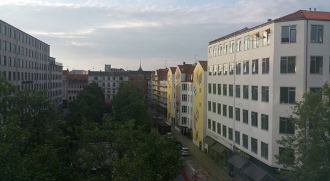
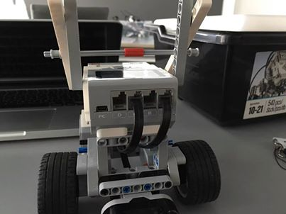
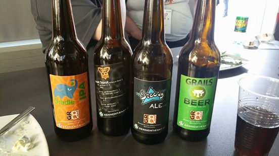

title: GR8Conf EU 2016 Wrap-up!
date: June 7, 2016  
description: GR8Conf EU 2016 Wrap-up!
author: Ryan Vanderwerf
image: 2016-06-07.jpg   
---

# [%title]

[%author]

[%date] 

Well I've just started to clear my jet-lagged head getting back from [GR8Conf EU](http://gr8conf.eu/) in Copenhagen, where [Object Computing, Inc.](https://objectcomputing.com/) (OCI) was a platinum sponsor this year. Lots of good stuff came out of the show, things announced, good workshops. This also was the first year there were 3 concurrent tracks for the EU edition. This worked out quite well and gave a good variety for everyone. There was also a university day with 3 hour workshops packed in all day long.

## Day 1: Workshops

I started the day doing my Groovy Lego Mindstorms EV3 talk where we worked with putting Groovy apps on the robots, then used Grails to control the robots like mars rovers.

Jeff Brown then did 2(!) back to back workshops on 'Getting Started with Grails 3' and 'Rest with Grails 3'. Andres Almiray did a Gradle workshop, Jacob Mikkelsen (Of Grails Diary fame) did a Groovy and Spock for beginners. Wrapping up was our own Alvaro Sanchez-Mariscal with a workshop on [building apps with Grails, AngularJS, and Spring Security](http://alvarosanchez.github.io/grails-angularjs-springsecurity-workshop/ "Building Apps with Grails"). I thought the workshops were very well attended this year, I could have used a couple more robots in mine, and I poked my head into full rooms on the other ones.

### Hackergarten on Tour

Andres Almiray led the Hackergarten this year again. His energy is very good and high which helps get people motivated for some open source contributions. Lots was done, I think several Spock issues merged, progress on Elastic Search 2 plugin for Grails 3, fixes for lazybones templates on Android Wear. One thing that will be good for Grails got lots of progress on a converter for the old gdoc format to ascii doctor [here](https://t.co/NA41R1DUjM)! Also a new Gradle Groovydoc plugin that forks the jvm [here](https://t.co/EsFOyuVx7n).

## Day 2: Talks

Kenneth Kousen kicked off the conference with a great keynote that talked about all the value Groovy has and talked about the decisions by Gradle to make Kotlin first class and Groovy second going forward. Lots of good points about what everyone can do to make Groovy better and what makes the community great - and a big one is needing maintainers for the Grails/Groovy support for Eclipse. Will someone step up? It is hard to say because almost everyone at the show used IntelliJ IDEA, so it's tough to be motivated to work on another IDE for the folks in larger companies who only have access to Community edition of IJ or Eclipse. Some asked will IntelliJ Community add support for Grails? We don't know but that'd be nice for a free option for Grails folks.

Here we start the 3 parallel tracks, with one being 'A Groovy journey in open source land' by Guillaume Laforge where we get a state of the union on Groovy. Following the Groovy track Jochen Theodorou talking about the new joint compiler which is very early. As an aside Jochen has started at Canoo (yay!), and unfortunately will have less time for Groovy now :( On a good note Cédric Champeau prepped a new release of Groovy 2.4.7 which is awaiting Apache approval for release.

After lunch we fire up again with our very own Jeff Scott Brown talking about monitoring and metrics in Grails 3 with a dropwizard plugin, Noam on clean Groovy, and a panel on the future of Groovy. I went to the panel which was led by Cedric, Jochen, and Jennifer. It was a frank upbeat discussion starting out with ribbing Gradle on Kotlin of course, then talking about what can be done to help drive Groovy adoption forward. Again the Eclipse support bubbled to the top again. Average Joe it seems misses the support in Eclipse and is lost without it.

I've heard following up that Marcin's talk on 'nooks and crannies of Spock' was quite good - lots to learn there. I didn't get a chance to attend the others but I peeked in the fame talk and looked interesting (does it archive?).

After that I sat in on the 'Ask the Grails Experts' panel with myself, Jeff, Alvaro, and Graeme. Lots of questions came up about Grails 4(????) including will the upgrade be hard like 2.5 to 3.0\. We're try our best but I don't think anyone knows what Grails 4 will look like yet :) Always lots of good questions answered about direction and features to keep everyone in the know, and a question on upgrading grails 2 -> 3 apps.

Next slot was some Android and Gradle (Ken), Groovy gateway drug(Jacob), and Migration to Grails 3 by Michael Ploed which I heard was quite good and helpful.

Wrapping up the talks was Mario David on Dockerizing your Grails app, Groovy Parallel, and Scraping the web with Geb.

Finishing the day, finally we get some of that Gr8 beer. They had 4 varieties this year, with the 4th one being a new Gradle IPA. Ironically a bitter beer for well um... (hrm did they know something that many months ago we didn't?) the world is weird like that.

Noam Tenne and Baruch Sadogursky did an really fantastic job with the Groovy Puzzlers. Lots of shirts were handed out for some good puzzlers. I think I knew more of them than I ever have before, so either I am getting better at this stuff or they are getting easier :)

## Day 3: Talks

We roll into day 3 running with talks about Grails 3 Plugins by our own Alvaro Sanchez-Mariscal, Jennifer Strater's CodeNarc revisited, and Sacha Klein's UI intro. Grame Rocher goes deeper into the new GORM 5 features and inner workings. Iván López from Greach talks about full stack development, and Danny Hyun gives an excellent Ratpack talk (and as of today Dan Wood's book is in print!).

Graeme Rocher gives us a mid morning keynote before he has to jump on a plane, he showed us some new features of 3.2, RX-Gorm, and more.

At this point I have to give my Alexa talk [slides here](https://speakerdeck.com/rvanderwerf/alexa-tell-me-im-groovy-gr8conf-dot-eu-2016) which went pretty well. I also (re)membered Alexa doesn't understand 'Grails' well since it's not a real word which the crowd got a good chuckle at some random tweets it started reading :) I missed but heard Cedric's and Puneet's talks were very good.

Next I attended Sergio del Amo's talk on building a conference app (for Greach) with Groovy, Android, and of all things Wordpress ;) very clever combination of things that seem to work well together. I missed Jennifer's talk on TDD for API Docs and Sacha Klein's talk on Groovy and Jenkins (which is something people either don't realize or forget about how much Jenkins uses Groovy!).

Wrapping up the conference is Jeff Scott Brown's 'Testing in Grails 3', Kenneth Kousen's "Groovy Tips and Tricks", and Noam Tenne's talk about Dockerizing your Ratpack app.

Some of the speakers got together for dinner after that at a Mexican place (I'm from Texas and was a bit puzzled this existed in Denmark heh) which is quite good! The next day some of the speakers still left in town did a Segway tour around the city. It looks geeky as heck, but it was pretty fun.

Special thanks to all the sponsors and Gr8Crew (especially Søren, Jacob, Niels, Brian and crew) that make the conference possible! It is a lot of work they do for many many months before the conference each year. This is the 3rd one I have spoken at and attended and the best yet. I'm sure 2017 will be even better. If you haven't been I recommend it. If it's far, take a tech-cation (As Burt Beckwith likes to call it) and see the beautiful city and learn something too. Maybe you can find a way to write it off your taxes for business, who knows :)

Also here is a Groovy podcast recorded at Gr8Conf.eu: [Groovy Podcast Episode 28](https://www.youtube.com/watch?v=Sj9P6_jT9R8)

***

## Slide Decks From the Conference

(cobbled together and ripped from tweets, Grails Diary, and Groovy Calamari)

*   [Alexa, Tell Me I'm Groovy!](https://speakerdeck.com/rvanderwerf/alexa-tell-me-im-groovy-gr8conf-dot-eu-2016) (Ryan Vanderwerf)
*   [Interesting nooks and crannies of Spock you (may) have never seen before](https://speakerdeck.com/szpak/interesting-nooks-and-crannies-of-spock-you-may-have-never-seen-before) (Marcin Zaj?czkowski)
*   [Creating applications with Grails, Angular JS and Spring Security](http://www.slideshare.net/alvarosanchezmariscal/creating-applications-with-grails-angular-js-and-spring-security-62646073) (Alvaro Sanchez-Mariscal)
*   [A Groovy journey in Open Source land](https://speakerdeck.com/glaforge/a-groovy-journey-in-open-source-land) (Guillaume Laforge)
*   [Introduction to the Java software model](http://melix.github.io/gr8conf2016-intro-software-model/#/) (Cédric Champeau)
*   [Variant aware dependency management with Gradle](http://melix.github.io/gr8conf2016-variant-aware-dep-mgmt/#/) (Cédric Champeau)
*   [Scraping with Geb](https://speakerdeck.com/sdelamo/scraping-with-geb) (Sergio del Amo)
*   [How to create a conference android app with Groovy and Android?](https://t.co/2GsyZuq2h8) (Sergio del Amo)
*   [Codenarc Revisited](https://speakerdeck.com/jlstrater/codenarc-revisited-gr8conf-eu-2016) (Jenn Strater)
*   [Rapid Ratpack Groovy Web App Development](https://danhyun.github.io/2016-gr8confeu-rapid-ratpack-groovy/#implementing_individual_todo_chain) (Danny Hyun)
*   [Mastering Grails 3 Plugins](http://www.slideshare.net/alvarosanchezmariscal/mastering-grails-3-plugins-gr8conf-eu-2016) (Alvaro Sanchez-Mariscal)
*   [Mum, I want to be a Groovy full-stack developer](http://www.slideshare.net/ilopmar/gr8conf-2016-mum-i-want-to-be-a-groovy-fullstack-developer) (Iván López)
*   [Introduction to Graphics- and UI-Design](http://de.slideshare.net/sascha_klein/introduction-to-graphics-and-uidesign) (Alexander (Sascha) Klein)
*   [Deep dive into the Groovy compiler](http://melix.github.io/gr8conf2016-deepdive-groovy-compiler/#/) (Cédric Champeau)
*   [Dockerize your Grails App for more deployment fun](https://speakerdeck.com/mariodavid/dockerize-your-grails-app-for-more-deployment-fun-gr8conf-eu-2016) (Mario David)
*   [Giving back to the Grails Community - Migrating plugins from Grails 2 to Grails 3](https://speakerdeck.com/behl/giving-back-to-the-grails-community-migrating-plugins-from-grails-2-to-grails-3) (Puneet Behl)
*   [Groovy and Spock Intro Workshop](http://imada.sdu.dk/~jamik/gr8conf-2016/workshop/#/) (Jacob Aae Mikkelsen)
*   [Groovy Gateway Drug](http://imada.sdu.dk/~jamik/gr8conf-2016/groovy-gateway-drugs/#/) (Jacob Aae Mikkelsen)
*   [Is Grails the right approach for business apps?](https://speakerdeck.com/mariodavid/is-grails-the-right-approach-for-business-apps-gr8conf-eu-2016) (Mario David)
*   [Groovy Powered Clean Code](http://www.slideshare.net/gr8conf/groovy-powered-clean-code) (Noam Tenne)
*   [Using Groovy with Jenkins](http://de.slideshare.net/sascha_klein/using-groovy-with-jenkins) (Alexander (Sascha) Klein)
*   [Ratpack On the Docks](http://www.slideshare.net/gr8conf/ratpack-on-the-docks) (Noam Tenne)
*   [Test Driven Approach to Documenting REST APIs w/ Spring REST Docs](https://speakerdeck.com/jlstrater/a-test-driven-approach-to-documenting-restful-apis-with-spring-rest-docs-gr8conf-eu-2016) (Jenn Strater)
*   [Hands On Migration from Grails 2 to 3](https://www.innoq.com/de/talks/2016/06/hands-on-migration-grails-2-to-3/) (Michael Plöd)
*   [Building reactive applications with the Grails 3 event system](https://www.innoq.com/de/talks/2016/06/reactive-applications-with-grails3/) ([code](https://github.com/mploed/grails-event-example)) (Michael Plöd)
*   [Metaprogramming with Groovy](http://www.slideshare.net/ilopmar/gr8conf-2016-metaprogramming-with-groovy) (Iván López)
*   [Grails Keynote / What's New In Grails 3](http://www.slideshare.net/graemerocher/gr8conf-2016-whats-new-in-grails-3) (Graeme Rocher)
*   [GORM Inside and Out](http://www.slideshare.net/graemerocher/gr8conf-2016-gorm-inside-and-out) (Graeme Rocher)
*   [Testing in Grails 3](http://jeffbrown.github.io/testingdemo/) (Jeff Scott Brown)
*   [Monitoring and Metrics in Grails 3]({{ site.url }}/downloads/MonitoringAndMetrics.pdf) (Jeff Scott Brown)
*   [Gradle Glam - Plugins Strike Back](http://www.slideshare.net/aalmiray/gradle-glam-plugis-strike-back) (Andres Almiray)

I look forward to the next edition! 

— Ryan Vanderwerf and the rest of the OCI/Grails Team