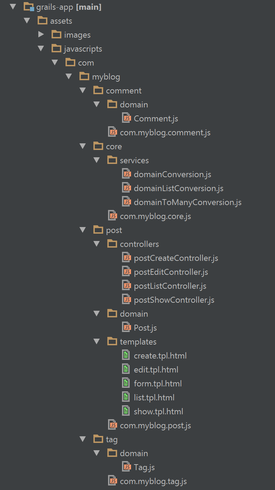
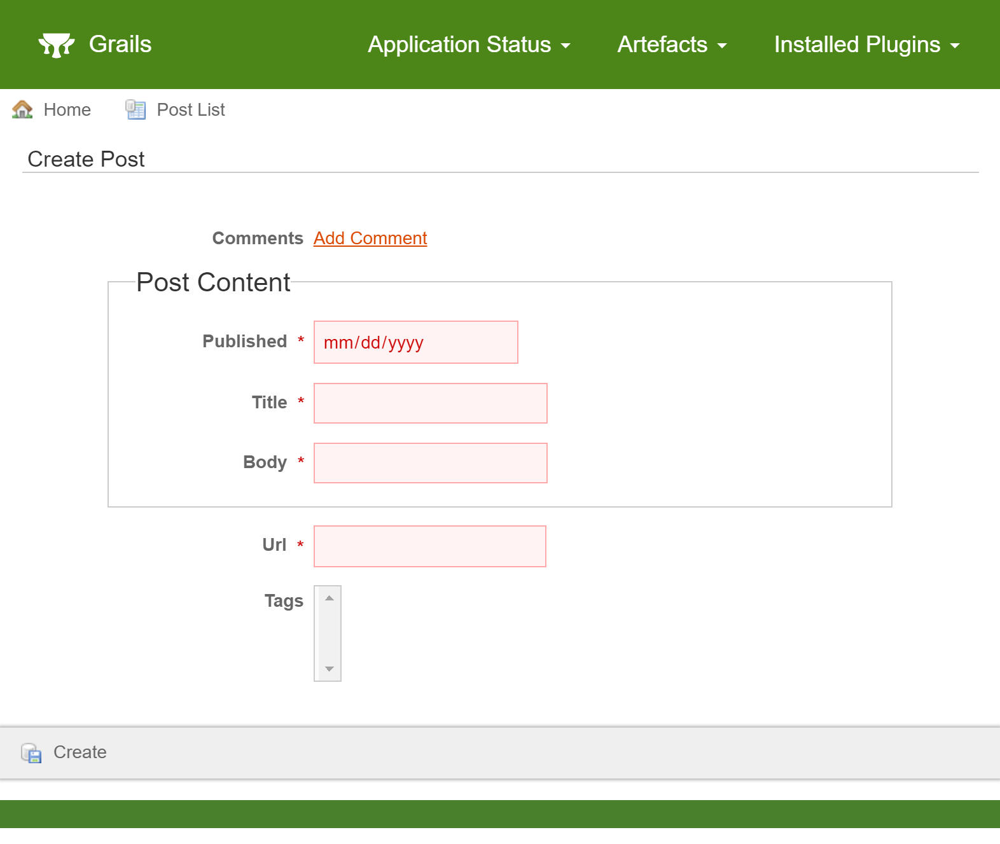
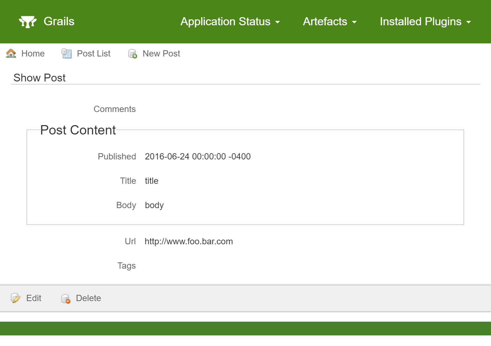
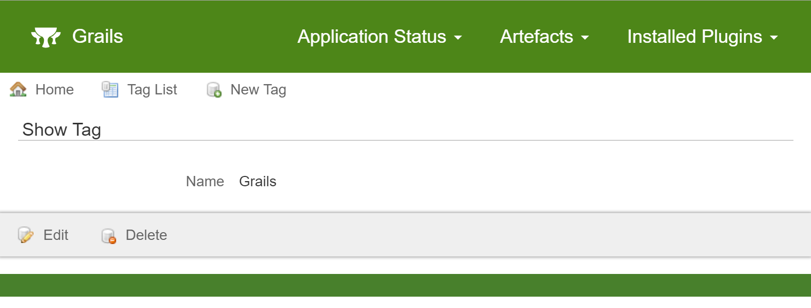
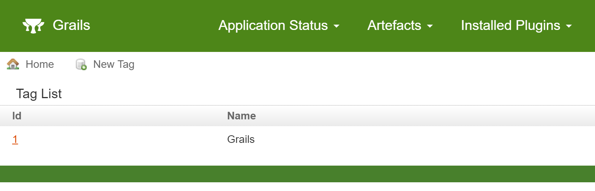
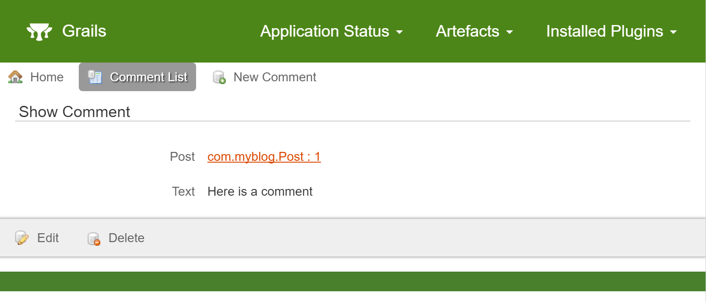
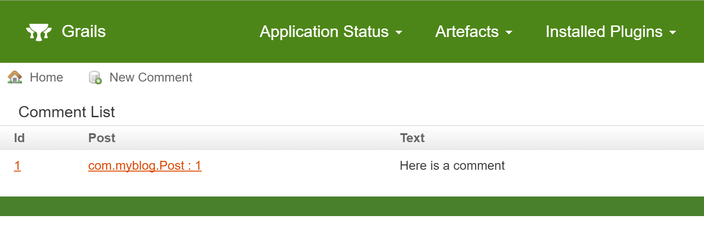

title: Grails® Angular Scaffolding
date: July 6, 2016  
description: Lean how to use Grails provided scaffolding capabilities within an Angular application
author: James Kleeh
image: 2016-07-06.jpg
CSS: [%url]/stylesheets/prism.css
JAVASCRIPT: [%url]/javascripts/prism.js
---

# [%title]

[%author]

[%date] 

Tags: #angular

Creating a single-page application (SPA) has never been easier than it is with the new [Grails<sup>&reg;</sup> Angular Scaffolding Plugin](https://github.com/grails-plugins/grails-angular-scaffolding)! This post will give you a short tutorial on how to use it.

***

The easiest way to get started with the scaffolding is to use the angular profile in Grails 3.2.0 or higher, which installs and configures the plugin automatically. See the [documentation](https://grails-plugins.github.io/grails-angular-scaffolding/latest) for information on how to get the plugin installed into an existing application.

For this tutorial, we will be working with the following domain classes.

```groovy
    package com.myblog

    import grails.rest.Resource

    @Resource(uri="/post")
    class Post {
        URL url
        PostContent postContent
        static embedded = ['postContent']
        static hasMany = [comments: Comment , tags: Tag]
        static constraints = {
        }
    }
    //---------------------------------
    package com.myblog

    class PostContent {
        String title
        String body
        Date published
        static constraints = {
        }
    }
    //---------------------------------
    package com.myblog

    import grails.rest.Resource

    @Resource(uri="/tag")
    class Tag {
        String name
        static constraints = {
        }
    }
    //---------------------------------
    package com.myblog

    import grails.rest.Resource

    @Resource(uri="/comment")
    class Comment {
        String text
        static belongsTo = [post: Post]
        static constraints = {
        }
    }
```

## Generating Assets

Generating client-side assets with this plugin is very easy. In this example, the domain class you would like to have assets generated for is `com.myblog.Post`:

```
    grails ngGenerateAll com.myblog.Post
```

To specify you wish any generated files to overwrite existing files:

```
    grails ngGenerateAll com.myblog.Post true
```

You can also execute the same command with gradle:

```
    ./gradlew ngGenerateAll -Pargs="com.myblog.Post true"
```

Some assets that are generated are common to all scaffolded modules. The scaffolding will generate those assets in the “core” module. The core module will be created in the same package as the module being generated if it doesn’t exist already.

If a core module already exists, it will not be overwritten, even if the overwrite parameter is true.

The following structure will be produced.



Note that other modules were created along with the post module.

A module for the `Comment` domain was created because the scaffolding will convert the list of comments to be instances of the `Comment` JavaScript domain.

The module for the `Tag` domain was also created by the scaffolding. The purpose of doing so is to facilitate retrieving a list of tags to choose from when creating a `Post`.

The modules for the `Tag` and `Comment` domains do not provide CRUD functionality. They exist solely to assist the `Post` module.

In the future, if you wish to scaffold the CRUD of `Tag`s or `Comment`s, execute the `ngGenerateAll` command with the second parameter set to “true” so the existing assets will be overwritten.

## Using the Assets

If you are using the angular profile in Grails 3.2.0 or higher, none of the steps below are required because they are all done for you!

If you are working with an existing application, there are a few steps you must take to make everything work together as designed.

1.  Ensure that the required third-party libraries exist where the scaffolding expects them to be.

    The scaffolding requires angular, angular-resource, and ui-router to function as designed. The default locations for those assets are:

    *   /angular/angular.js
    *   /angular/angular-ui-router.js
    *   /angular/angular-resource.js

    You can change the default locations with configuration. See the [asset paths](https://grails-plugins.github.io/grails-angular-scaffolding/latest/#_asset_paths) section in the documentation to learn how to do so.

2.  Ensure the required asset pipeline plugins have been imported.

    The scaffolding is designed around the use of three asset pipeline plugins. Include the plugins in your project via the instructions in the links below.

    *   [Angular Annotate Asset Pipeline](https://github.com/craigburke/angular-annotate-asset-pipeline)
    *   [Angular Template Asset Pipeline](https://github.com/craigburke/angular-template-asset-pipeline)
    *   [JS Closure Wrap Asset Pipeline](https://github.com/craigburke/js-closure-wrap-asset-pipeline)

3.  Ensure databinding handles the default date format.

    The scaffolding relies on the default format Angular applies to dates when they are included in a request. In Grails 3.1.x, the date format is not included in the default list of date formats that databinding will attempt to use. You can easily add it yourself via configuration.

```
        grails:
            databinding:
                dateFormats:
                    - "yyyy-MM-dd'T'HH:mm:ss.SSSX"
```

4.  Ensure the module is loaded on the page

    If the "parent" module is already being required by your current code, there is nothing you need to do to get the newly generated module to be included wherever the parent module is. The scaffolding will automatically attempt to create a module dependency and require statement in the parent module.

    Here is an example of what that might look like.

```
        grails ngGenerateAll com.myblog.Post
```

    *   If `grails-app/assets/javascripts/com/myblog/com.myblog.js` exists, it will be considered to be the parent module. The scaffolding will attempt to edit the file to add a dependency to the `post` module.

    If a parent module does not exist or the parent module isn’t being included on the desired page, it is up to you to use asset pipeline to include it where it is needed.

5.  Ensure a `ui-view` directive is on the page for the state to load HTML into.

    See the ui-view [documentation](https://github.com/angular-ui/ui-router/wiki/Quick-Reference#ui-view target=) on how to do this.

6.  Ensure the `ng-app` directive is on the page. `ng-app="com.myblog.post"`

7.  Naviage to the route `[http://localhost:8080/#post](http://localhost:8080/#post)`

## CRUD

The following images depict what you will see when you have successfully navigated to the ‘post’ route and begin creating `Post`s.

List


Create


Note that clicking “Add Comment” at this time will not have any effect because the comment scaffolding has not been created.

Show


## Generating Associated Domains

The logical next step will be to generate the `Tag` scaffolding so we can create tags. This will allow us to choose tags when creating or editing our `Post`.

```
    grails ngGenerateAll com.myblog.Tag true
```

Note that the second parameter “true” is important because we already had a Tag module which we will need to overwrite in order for the scaffolding to function correctly.

In addition, we can generate the comment scaffolding so we can assign comments to posts.

```
    grails ngGenerateAll com.myblog.Comment true
```

The following are screen captures of what you can expect once the associated domain classes are generated.

### Tag

Create


Show


List


### Comment

Create


Show


List


## Conclusion

Now that all domain classes have scaffolding, you can manage your data in a single page application.

The scaffolding is designed as a starting point for rapid development. Explore the generated JavaScript code and make changes to meet your business requirements. If you run into any issues, please submit an issue on the github page [here](https://github.com/grails-plugins/grails-angular-scaffolding/issues) or come chat with us about it in our [Slack](https://grails.slack.com/) channel.

For a complete run through of installing and using the scaffolding in Grails 3.1.x, check out this [Quickcast](https://grails.org/blog/2017-01-20-2.html)!

The example project created in the video is available [here](https://github.com/grails-samples/angular-scaffolding-31x).
