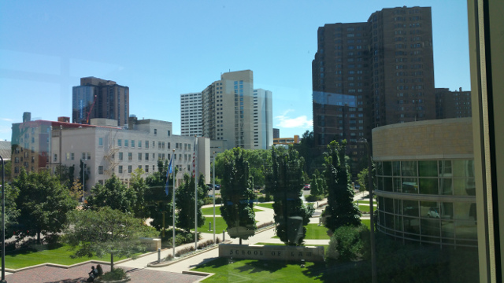
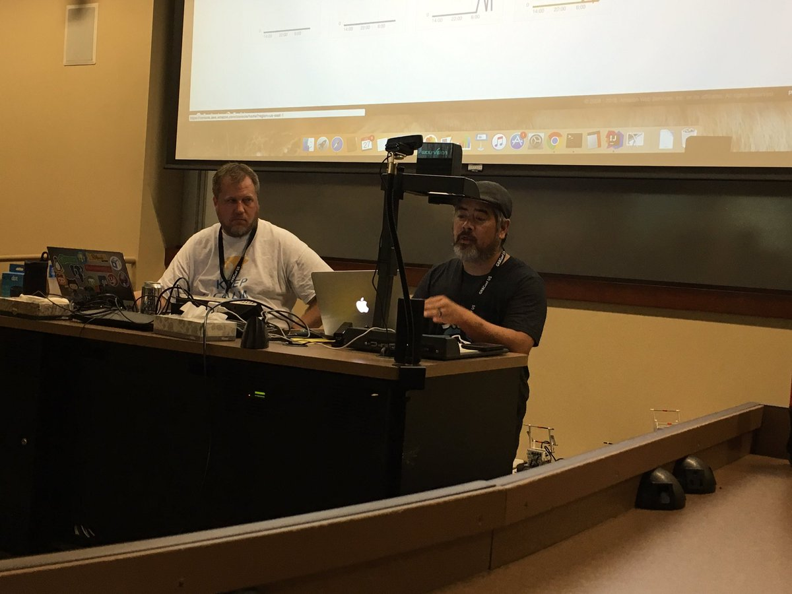
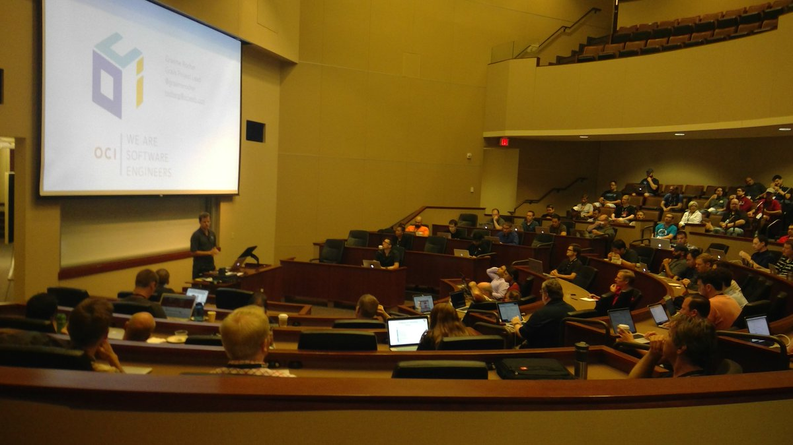
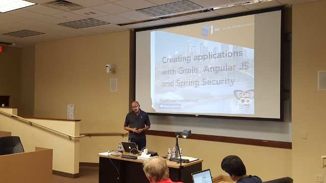
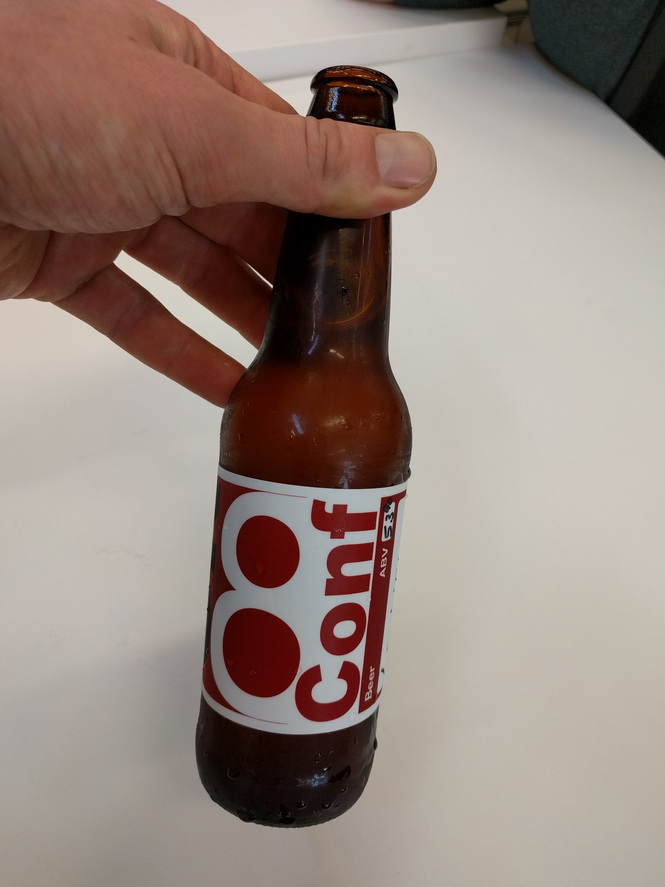
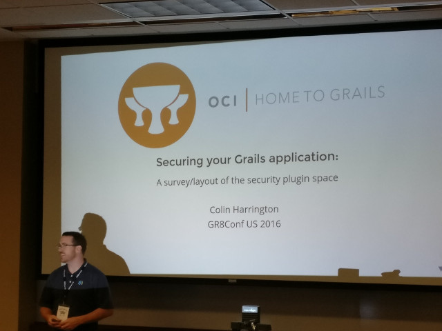
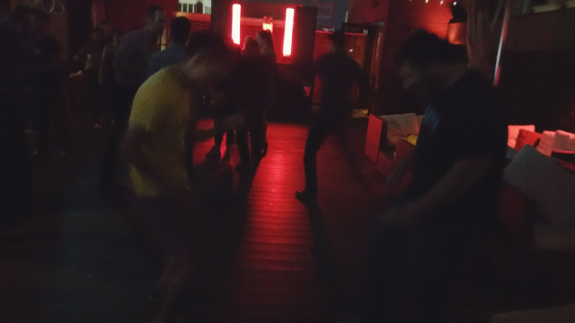

title: GR8Conf US 2016 Wrap-up!
date: August 1, 2016  
description: GR8Conf US 2016 Wrap-up!
author: Ryan Vanderwerf
image: 2016-08-01.jpg   
---

# [%title]

[%author]

[%date] 

Well I've just started to clear my fuzzy head getting back from [GR8Conf US](http://gr8conf.us/) in Minneapolis, where OCI was a platinum sponsor this year. Lots of good stuff came out of the show, things announced, good workshops. There were 4 concurrent tracks of talks for 2 days, and 1 day of workshops. In all, the OCI Grails team delivered 4 workshops and 8 talks - most of the team creates these talks on their own time as well in addition to our regular responsibilities. We are dedicated!

I grew up in a suburb in St. Paul and had not been back since I started speaking at Gr8Conf 3-4 years ago. What a beautiful city it is now! So much stuff going on, sports games, music, breweries and a pretty clean downtown. Can't recommend enough to come visit here in the summer - that said I would avoid it in the thick of winter - it's so cold they build sky-bridges to connect the buildings to minimize the outside elements! Check out one of these great buildings at night. The picture below is looking out from the University of St. Thomas, the venue.

## Day 1: Workshops

I started the day doing my Groovy Lego Mindstorms EV3 talk where we worked with putting Groovy apps on the robots, then used the Grails framework to control the robots like Mars rovers. I Then did a 2nd half day workshop with my friend Lee Fox on Amazon Alexa. We built Groovy Lambda Skills as well as Grails 3 Skills.

Jeff Brown then did 2(!) back-to-back workshops on 'Getting Started with Grails 3' and 'Rest with Grails 3' (*Pic by Annyce Davis). 

Danny Hyun did a Groovy intro workshop where he taught people to use a Pokemon Java API to help them catch them all in Groovy (all day). 
Marcin Erdmann (His first stateside appearance at Gr8?) did an all day Ratpack sandbox workshop.

## Day 2: Talks

Graeme Rocher kicked off the conference with his keynote about all the goodness upcoming in Grails 3.2, GORM 6, and how overall better things are about Grails 3 as well as the future.

Here we start the 4 parallel tracks, with one being 'Groovy for Java Developers' by Puneet Behl where he teaches how Groovy makes life better for Java devs.

In the same slots were "Getting Started with Grails 3" by OCI Grails team member Colin Harrington gave a great Grails 3 intro talk.

Also there was "GroovyFX - Groove JavaFX" by Alexander Sasha Klein on all the goodies aroung GroovyFX.

Next up: Dynamic GORM by Burt Beckwith, Monitoring and Metrics with Grails 3 by OCI Grails Team co-founder Jeff Scott Brown. Craig Burke always brings the laughs with "Practical and Stupidly Impractical Groovy DSLs. Android Groovy plugin maintainer Andrew Reitz did a good talk on testing Gradle plugins, which is something people often overlook but is needed.

Next slot after lunch: Lee Fox and I do the "Alexa Tell me I'm Groovy" talk which we covered AWS Groovy Lambda Skills and The Grails 3 plugin. Lee made a superhero quiz game and Baruch from JFrog stepped up to test his skills. Needless to say he said his name and Alexa said 'I heard bottles' and proceeded to ask 'Bottles' trivia questions. So that is Baruch's new nickname, try it out next time you see him :) The audience got lots of laughs from all the Alexa antics we did. It gets better, we used a Grails app we wrote for Alexa to live-tweet the audience reaction. So much fun!

While this was going on fellow OCI Grails team member Alvaro Sanchez-Mariscal did 'Mastering Grails 3 Plugins' with some solid advice on Grails 3 to avoid pain later. Asset-pipeline creator Dave Estes did a great talk on the ins and outs of asset-pipeline which every Grails developer should learn and know. Finishing this slot is Jenn Strater's talk on a TDD Approach to Documenting Restful APIs which a lot of people were excited about all of the documentation tools she showed off.

Last talk slot of the day: 

Bob the Builder by Sascha Klein shared his tips of using builder patterns for daily survival. Teammate Alvaro continued with another talk on Creating apps with the Grails framework, AngularJS, and Spring Security which is a shorter talk version of the workshop he did at Gr8Conf.eu this year. Annyce Davis a new speaker I met this year did a great talk on From the Grails framework to Android: A Simple Journey. Finishing the talks for the day was Jenn Strater with "CodeNarc Revisited."

Kenneth Kousen closed up the day with a great keynote that talked about all the value Groovy and all the community has to offer.

After the talks and keynote, Object Partners was kind enough to bus everyone to their new offices in North Minneapolis for Gr8ConfUS beer, appetizers, and Groovy Puzzlers with Baruch(Bottles) and Dan Woods.

## Day 3 Talks

We roll into day 3 running with (almost) a complete track of talks about Ratpack by Dan Woods (9am after late night karaoke, impressive!), non web Ratpack with John Engelman, and testing Rackpack with Danny Hyun. Back to chronological order, Puneet Behl talked about Giving back to the community by helping migrate 2.x plugins to 3.x. Annyce David talked about Gradle Plugin Goodness, and Ryan Applegate talked about scaling Grails apps at SmartThings.

Craig Burke talked about AngularJS in Grails apps as well as trolled Kyle Boon and myself pretty hard (His test is totally rigged I say!). Jeff Brown from OCI Grails Team talked about Groovy Metaprogramming, and Charlie Knudsen talked about a strategy to get to zero downtime deployments.

Next slot we had fellow OCI Grails teammate Colin Harrington talk about how to secure your Grails application via Spring Security Plugins. Sacha Klein also gave a Groovy with Jenkins talk about using Groovy in your CI pipeline. Todd Miller talked about Spring Cloud in production with tools like Eureka and Hystrix/Turbine to monitor your apps. Craig Atkinson also gave a great Spock and Geb into talk.

After lunch Burt Beckwith talked about Spring Security, Christian Oestreich talked about monitoring Grails 3 applications, Craig Atkinson gave another great functional testing talk with Geb. Stephen Pember gave a mind-bender talk on Reactive Streams and Groovy to finish out the time slot.

Last talks of the day are now underway with "Grails Reactive Event-Driven Architecture" by Christian Oestreich (He maintains several Grails plugins like CXF/Client), Dockerize It All by Puneet Behl, and last but not least a JOOQ intro talk by Stephen Pember.

Wrapping up the conference, John Engelman gave the closing keynote about writing software in the Agile age, culture devops, and other good stuff.

After that, Ken Kousen and Baruch(Bottles) Sadogursky did a live Groovy podcast with a studio audience!. The link for it is [here](https://www.youtube.com/watch?v=MWRWnKfbnIs).

Once the broadcast concluded, most of the attendees went home, but many speakers and attendees stayed and went to the Gr8Ladies sponsored happy hour. That extended to the roof later, where the Ratpack folks really showed their dance moves, especially Danny Hyun!

Special thanks to out to all the volunteers and helpers for the conference, especially Bobby Warner, Shaun Jurgenmeyer, Eric Kinsella, Doug Sabers, and Jenn Strater!

I hope to be back again next year, as you won't find a nicer, friendlier accessible bunch than the folks at the Gr8Conf conferences. Come for the content, stay for the socialization and networking! The more I go to these events, I find the value scale for networking goes higher and higher, which is something you just can't get off youtube videos and posted slides. Come to see what others are doing or not doing because it didn't work - It could save your next project from failure!

***

## Slide Decks From the Conference

(cobbled together and ripped from tweets and Grails Diary)

### Workshops

[Exercises for Getting started with Grails 3 (Jeff Scott Brown)](https://www.dropbox.com/sh/ah2uxd9he0x4p4f/AACGHZEiY-PP9Zl3qpLCI4XOa?dl=0)

[Getting Groovy with Lego Mindstorms (Ryan Vanderwerf)](http://www.slideshare.net/ryanvanderwerf/getting-groovy-with-lego-mindstorms-ev3-gr8conf-us-2016)

[Amazon Alexa Workshop (Ryan Vanderwerf and Lee Fox](http://www.slideshare.net/ryanvanderwerf/amazon-alexa-workshop-grpovy-and-grails-gr8conf-us-2016) also labs [here](https://sites.google.com/site/alexaskillslab/)

[Groovy Workshop 2016 (Daniel Hyun)](https://danhyun.github.io/2016-gr8conf-groovy-workshop/)

### Talks – Day 2

[Getting started with Grails 3 (Colin Harrington)](http://slides.com/colinharrington/getting-started-with-grails-3-gr8confus-2016#/)

[Practical and Stupidly Impractical Groovy DSLs (Code) (Craig Burke)](http://www.craigburke.com/groovy-dsl/)

[Alexa, Tell Me I'm Groovy (Ryan Vanderwerf / Lee Fox)](https://speakerdeck.com/rvanderwerf/alexa-tell-me-im-groovy-gr8conf-us-2016)

[Mastering Grails 3 plugins (Alvaro Sanchez-Mariscal)](http://www.slideshare.net/alvarosanchezmariscal/mastering-grails-3-plugins-gr8conf-us-2016)

[Codenarc Revisited (Jenn Strater)](https://speakerdeck.com/jlstrater/codenarc-revisited-gr8conf-us-2016)

[From Grails to Android (Annyce Davis)](http://www.adavis.info/2016/07/talk-from-grails-to-android.html)

[A Test-Driven Approach to Documenting RESTful APIs with Spring REST Docs (Jenn Strater)](https://speakerdeck.com/jlstrater/a-test-driven-approach-to-documenting-restful-apis-with-spring-rest-docs-gr8conf-us)

### Talks – Day 3

[Securing your Grails application: A survey/layout of the security plugin space (Colin Harrington)](http://slides.com/colinharrington/springsecuritysurvey-gr8conf-us-2016#/)

[Scaling Grails at SmartThings (Ryan Applegate)](https://speakerdeck.com/rappleg/scaling-grails-at-smartthings)

[Gradle Plugin Goodness (Annyce Davis)](http://www.adavis.info/2016/07/talk-gradle-plugin-goodness.html)

[Creating applications with Grails, Angular JS and Spring Security - (code) (Alvaro Sanchez-Mariscal)](http://www.slideshare.net/alvarosanchezmariscal/creating-applications-with-grails-angular-js-and-spring-security-gr8conf-us-2016)

[Intro to Spock and Geb (Craig Atkinson)](http://craigatk.github.io/spock-geb-intro/)

[Monitoring Grails 3 Applications (Christian Oestreich)](https://github.com/Grails-Plugin-Consortium/gr8conf-monitoring-metrics)

[Grails Reactive Event-Driven Architecture (Christian Oestreich)](https://github.com/Grails-Plugin-Consortium/gr8conf-event-driven-microservices)

[Geb Tips and Tricks (Craig Atkinson)](http://craigatk.github.io/geb-tips-tricks/#/)

[Testing Ratpack Applications (Danny Hyun)](https://danhyun.github.io/2016-gr8confus-testing-ratpack-apps/)

[Reactive Streams and the Wide World of Groovy (Steve Pember)](http://www.slideshare.net/StevePember/reactive-streams-and-the-wide-world-of-groovy-64526341)

[An Introduction to jOOQ - code (Steve Pember)](http://www.slideshare.net/StevePember/an-introduction-to-jooq)

### Some Other Recaps

[Annyce Davis](http://www.adavis.info/2016/07/gr8conf-us-2016-recap.html)

[Roberto Perez A.](http://rpalcolea.github.io/blog/2016/GR8Conf-US-Recap-2016.html)

I look forward to the next edition in 2017! 

— Ryan Vanderwerf and the rest of the OCI/Grails Team