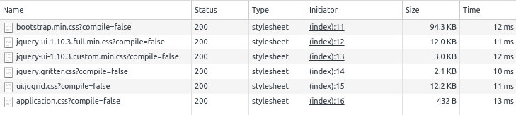
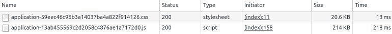

title: How to Migrate from Resources Plugin to Asset-Pipeline
date: September 12, 2016  
description: Migrate from resources plugin to asset-pipeline in the Grails® framework
author: Iván López
image: 2016-09-12.jpg  
---

# [%title]

[%author]

[%date] 

Tags: #plugins

## Introduction

Since Grails<sup>&reg;</sup> 2.4.0, [asset-pipeline](https://grails.org/plugin/asset-pipeline) has been the default plugin recommended to manage the static resources in a Grails application. In earlier versions of the Grails framework, the [resources](http://grails.org/plugin/resources) plugin was an option, but with Grails 3, the only viable option is using asset-pipeline because resources is not available in Grails 3.

If you want to know how to migrate from resources to asset-pipeline, this post is for you.

## Let's Migrate!

I recommend you start the migration analyzing your layouts because probably those files contain most of your static resources (javascripts and css files). Imagine that the content of your `main.gsp` layout is the following:

```html
<link rel="stylesheet" href="${resource(dir: 'assets/css', file:'bootstrap.min.css') }" />
<link rel="stylesheet" href="${resource(dir: 'assets/css', file:'jquery-ui-1.10.3.full.min.css') }" />
<link rel="stylesheet" href="${resource(dir: 'assets/css', file:'jquery-ui-1.10.3.custom.min.css') }" />
<link rel="stylesheet" href="${resource(dir: 'assets/css', file:'jquery.gritter.css') }" />
<link rel="stylesheet" href="${resource(dir: 'assets/css', file:'ui.jqgrid.css') }" />

<script src="${resource(dir:'assets/js', file:'bootstrap.min.js')}"></script>
<script src="${resource(dir:'assets/js', file:'jquery-2.0.3.min.js')}"></script>
<script src="${resource(dir:'assets/js', file:'jquery-ui-1.10.3.custom.min.js') }"></script>
<script src="${resource(dir:'assets/js', file:'jquery-ui-1.10.3.full.min.js') }"></script>
<script src="${resource(dir:'assets/js', file:'jquery.mobile.custom.min.js')}"></script>
<script src="${resource(dir:'assets/js', file:'jquery.slimscroll.min.js')}"></script>
<script src="${resource(dir:'assets/js', file:'jquery.gritter.min.js')}"></script>
<script src="${resource(dir:'assets/js', file:'jquery.hotkeys.min.js')}"></script>
<script src="${resource(dir:'assets/js', file:'jquery.easy-pie-chart.min.js')}"></script>
<script src="${resource(dir:'assets/js', file:'jquery.maskedinput.min.js')}"></script>
<script src="${resource(dir:'assets/js', file:'jquery.dataTables.min.js')}"></script>
<script src="${resource(dir:'assets/js', file:'jquery.dataTables.bootstrap.js')}"></script>
<script src="${resource(dir:'assets/js/jqGrid', file:'jquery.jqGrid.min.js')}"></script>
<script src="${resource(dir:'assets/js/jqGrid/i18n', file:'grid.locale-en.js')}"></script>
```

As you can see, there are a bunch of css and javascript files that are mostly related to jQuery, but all of those files are on the same directory. When doing the migration, we're also going to reorganize the files in a better way.

By default, asset-pipeline creates the directories `images`, `javascripts`, and `stylesheets` under `grails-app/assets` directory. Any file you copy into those directories can be served by the plugin. The easy way would be to copy all of the css and javascript files to those directories and change the way we import the resources.

For example, with the following directory structure:

```bash
.
├── javascripts
│   └── bootstrap.min.js
└── stylesheets
    └── bootstrap.min.css
```

You could replace the following code:

```html
<!-- Using resources -->
<link rel="stylesheet" href="${resource(dir: 'assets/css', file:'bootstrap.min.css') }" />
<script src="${resource(dir:'assets/js', file:'bootstrap.min.js')}"></script>
```

With this one:

```html
<!-- Using asset-pipeline -->
<asset:stylesheet src="bootstrap.min" ></asset:stylesheet>
<asset:javascript src="bootstrap.min" ></asset:javascript>
```

Please notice that you don't need to include the `.js` or `.css` extension because asset-pipeline will add it when looking for the files in those directories.

As I said, you could just copy all those files and create a lot of entries in your layout using `asset:stylesheet` and `asset:javascript`, but we can do it better.

## Defining Bundles

If you take a look at the content of the `grails-app/assets` directory created by default, you can find the files `application.js` and `aplication.css`.

Let's take a look at the content of the `application.css` file:

```css
/*
* This is a manifest file that'll be compiled into application.css, which will include all the files
* listed below.
*
* Any CSS file within this directory can be referenced here using a relative path.
*
* You're free to add application-wide styles to this file and they'll appear at the top of the
* compiled file, but it's generally better to create a new file per style scope.
*
*= require bootstrap
*= require grails
*= require main
*= require mobile
*= require_self
*/
```

We're defining a bundle called `application` (the name of the file) that will contain `bootstrap`, `grails`, `main`, and `mobile` stylesheet files. Starting with that we're going to add the rest of the original files we were using with resources plugin:

```css
/*
*= require bootstrap.min
*= require jquery/css/jquery-ui-1.10.3.full.min
*= require jquery/css/jquery-ui-1.10.3.custom.min
*= require jquery/css/jquery.gritter
*= require jqGrid/ui.jqgrid
*/
```

You can create arbitrary bundles of your js and css files, defining files in the root of those directories and declaring the files you want to add to that bundle. Now we're going the create a bundle for the javascript files:

```javascript
//
// require bootstrap.min
//= require jquery/js/jquery-2.0.3.min
//= require jquery/js/jquery-ui-1.10.3.custom.min
//= require jquery/js/jquery-ui-1.10.3.full.min
//= require jquery/js/jquery.mobile.custom.min
//= require jquery/js/jquery.slimscroll.min
//= require jquery/js/jquery.gritter.min
//= require jquery/js/jquery.hotkeys.min
//= require jquery/js/jquery.easy-pie-chart.min
//= require jquery/js/jquery.maskedinput.min
//= require jquery/js/jquery.dataTables.min
//= require jquery/js/jquery.dataTables.bootstrap

//= require jqGrid/jquery.jqGrid.min
//= require jqGrid/i18n/grid.locale-en
```

With these two bundles defined, the only thing you need to do is replace all those javascript and stylesheet imports in your layout with the following lines:

```html
<asset:stylesheet src="application" ></asset:stylesheet>
<asset:javascript src="application" ></asset:javascript>
```

Now we can run the application, open the inspector and see what happens:




All the javascript and css files are loaded in debug mode. This means that the resources won't be optimized and you'll have hot-reloading of the changes. This is the default behavior during development. For production all files will be minified and included in one file per bundle:



## Organizing Bundles

One last thing about organizing the bundles is that if we want to create our custom directories, we need to create a top level directory in `grails-app/assets`, and inside that directory, we can create our arbitrary structure. I've named this directory `libs`, but you can use the name you want:

```bash
.
├── javascripts
│   ├── application.js
│   └── bootstrap.min.js
├── libs
│   ├── jqGrid
│   │   ├── i18n
│   │   │   └── grid.locale-en.js
│   │   ├── jquery.jqGrid.min.js
│   │   └── ui.jqgrid.css
│   └── jquery
│       ├── css
│       │   ├── jquery.gritter.css
│       │   ├── jquery-ui-1.10.3.custom.min.css
│       │   └── jquery-ui-1.10.3.full.min.css
│       └── js
│           ├── jquery-2.0.3.min.js
│           ├── jquery.dataTables.bootstrap.js
│           ├── jquery.dataTables.min.js
│           ├── jquery.easy-pie-chart.min.js
│           ├── jquery.gritter.min.js
│           ├── jquery.hotkeys.min.js
│           ├── jquery.maskedinput.min.js
│           ├── jquery.mobile.custom.min.js
│           ├── jquery.slimscroll.min.js
│           ├── jquery-ui-1.10.3.custom.min.js
│           └── jquery-ui-1.10.3.full.min.js
└── stylesheets
    ├── application.css
    └── bootstrap.min.css
```

Effectively, asset-pipeline treats each of the subdirectories of `grails-app/assets` as another root for locating assets.

## Conclusion

As you have seen in this post, it's pretty simple to organize the static resources using asset-pipeline plugin and migrate from resources.

If you want to take a closer look to the code, this example application is available [here](https://github.com/ilopmar/example-asset-pipeline).


