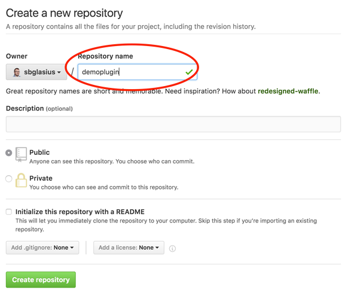
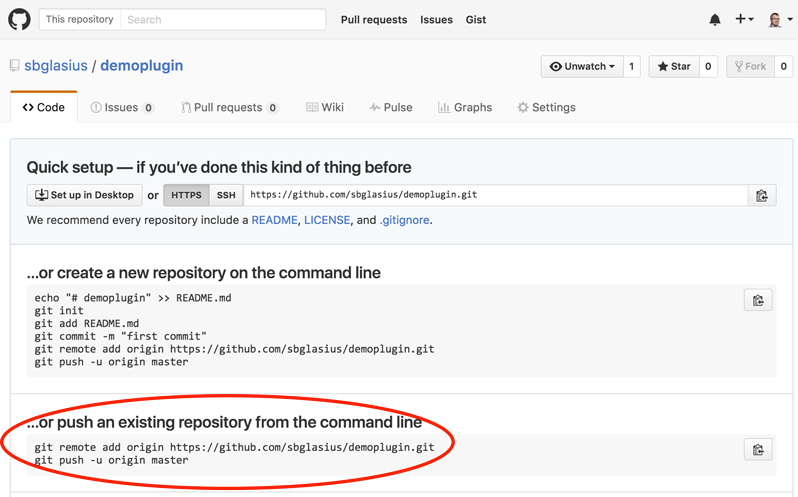

title: How to Use Travis-CI to Build and Deploy Your Plugin
date: October 3, 2016  
description: How to Use Travis-CI to Build and Deploy Your Grails® 3 Plugin
author: Søren Berg Glasius
image: 2016-10-03.jpg   
CSS: [%url]/stylesheets/prism.css
JAVASCRIPT: [%url]/javascripts/prism.js
---

# [%title]

[%author]

[%date] 

Tags: #plugins #travis

## Introduction

When you create a Grails<sup>&reg;</sup> 3 plugin and you want to share it with the world, wouldn't it be great if building and deploying was taken care of by a CI server?

In this blog I will show you how to set up a Grails Plugin project that will be built and deployed on the [Travis-CI infrastructure](https://travis-ci.org/).

Let us start out by setting up the project, so that it can be deployed to Bintray. Then we will add a Travis build to the mix. Finally we will explore how to handle snapshot deployment to [JFrog's open source repository](https://oss.jfrog.org/).

## How Travis-CI Works

Travis-CI works by monitoring your GitHub repository and whenever it sees changes, it will make a build of your project. The change can be a new commit pushed to GitHub, a new tag pushed to GitHub, or a pull request to your project on GitHub.

If you want a deeper knowledge on how Travis-CI works, please [see the documentation](https://docs.travis-ci.com/).

## Getting Started

While you might have a plugin already, let us start this example by creating a plugin. The plugin will not have any functionality; it is only here to show the steps.

```bash
grails create-plugin -profile plugin demoplugin
cd demoplugin
```

To get Travis-CI working the project has to live on GitHub.

### Setting Up a GitHub Repository

The first step is to enable Git for the local repository, add the project files, and commit it:

```bash
git init
git add .
git commit -m "Initial commit"
```

Now go to [GitHub](https://github.com/) where we create a new repository:







And push the first commit to GitHub:

```bash
git remote add origin https://github.com/sbglasius/demoplugin.git
git push -u origin master
```

### Publishing Plugin to Bintray

Before configuring Travis, let us update the configuration to enable publishing the plugin to Bintray and the Grails Plugin Portal.

`build.gradle` already contains the building blocks for this:

```groovy
// ...
group "org.grails.plugins"
// ...
apply plugin:"org.grails.grails-plugin"
// ...
grailsPublish {
    // TODO: Provide values here
    user = 'user'
    key = 'key'
    githubSlug = 'foo/bar'
    license {
        name = 'Apache-2.0'
    }
    title = "My Plugin"
    desc = "Full plugin description"
    developers = [johndoe:"John Doe"]
    portalUser = ""
    portalPassword = ""    
}
```

As can be seen, some values are not filled in, like credentials and `githubSlug`. Let us add those values in a way where credentials are not visible in the public GitHub repository.

My code snippet will contain two ways to fetch configuration values:

```groovy
grailsPublish {
    user = System.getenv("BINTRAY_USER") ?: project.bintrayUser
    key = System.getenv("BINTRAY_KEY") ?: project.bintrayKey
    githubSlug = 'https://github.com/sbglasius/demoplugin'
    license {
        name = 'Apache-2.0'
    }
    title = "Demo Plugin"
    desc = "A Demo Plugin, no need to publish"
    developers = [johndoe:"John Doe"]
    portalUser = System.getenv("GRAILS_PORTAL_USER") ?: project.grailsPortalUser
    portalPassword = System.getenv("GRAILS_PORTAL_PASSWORD") ?: project.grailsPortalPassword
}
```

The configuration values are now read from either the running environment (this is where Travis will provide them, more on this later) or they will be taken from the project configuration or Gradle's global configuration (`~/.gradle/gradle.properties`). That is where I recommend storing these credentials.

The format for `~/.gradle/gradle.properties` is like this:

```properties
bintrayUser=user
bintrayKey=[secret]

grailsPortalUser=user
grailsPortalPassword=[secret]
```

With this in place, it is now possible to publish the plugin to Bintray. This can be done like this:

```bash
./gradlew bintrayUpload
```

Before moving on to Travis, let me push this to GitHub:

```bash
git add .
git commit -m "Build script for Gradle"
git push
```

## Set Up Travis Command Line

Before we can use Travis, we need to install the Travis Command line. Travis Command line requires Ruby, and since my machine is a Mac, Ruby is included. For other OSes, please go [here](https://www.ruby-lang.org/en/) for more information.

Install Travis

```bash
gem install travis
```

## Adding Travis to the Project

The first thing we will do is initialize Travis for the project.

```bash
$ travis init
Detected repository as sbglasius/demoplugin, is this correct? |yes|
Main programming language used: |Ruby| Groovy
.travis.yml file created!
sbglasius/demoplugin: enabled :)
```

Take a look in `.travis.yml`. You should see one line of code:

```yml
language: groovy
```

Let us push this change to GitHub:

```bash
git add .travis.yml
git commit -m "Added travis config"
git push
```

This will result in the first Travis build – a failed build. When Travis tries to run `gradle assemble` it fails with the following error:

```text
FAILURE: Build failed with an exception.
* Where:
Build file '/home/travis/build/sbglasius/demoplugin/build.gradle' line: 50
* What went wrong:
A problem occurred evaluating root project 'demoplugin'.
> Could not find property 'bintrayUser' on root project 'demoplugin'.
* Try:
Run with --stacktrace option to get the stack trace. Run with --info or --debug option to get more log output.
BUILD FAILED
```

As we can see from the error, it cannot find the `bintrayUser` in the properties – since it is not defined yet together with the other credential properties.

Travis has the ability to set environment variables defined in .travis.yml, but we do not want credentials in clear text. Fortunately, Travis support [encrypting environment variables](https://docs.travis-ci.com/user/environment-variables#Defining-Variables-in-.travis.yml). It is important to understand that the variables added here will only work for the GitHub account associated with the project.

### Adding Environment Variables to `.travis.yml.`

Let us add four variables to the configuration under `env.global`:

```bash
travis encrypt BINTRAY_USER=user --add env.global
travis encrypt BINTRAY_KEY=*** --add env.global
travis encrypt GRAILS_PORTAL_USER=user --add env.global
travis encrypt GRAILS_PORTAL_PASSWORD=[secret] --add env.global
```

Now `.travis.yml` looks like this:

```yml
 language: groovy
env:
  global:
  - secure: iU4Y3JVWFteYl6J9MIlKv4H6nT0...
  - secure: xPW7KBPVHe64hMloY30Oa5WowYO...
  - secure: mhCnvHfjPX+wudLOfo6B8MFVGBV...
  - secure: QF0+kEZLjL3ZJe0U/5jKC1dijgm...
```

and then commit and push to GitHub.

_Now the build goes green on Travis_, but it is still not publishing the plugin to Bintray. That's up next.

## Publish to Bintray with Travis

Travis should test `master` on GitHub every time code is committed. It should build pull-requests but should only release the plugin to Bintray, when Git is tagged with a new version.

The developers of Travis have thought of this and allow us to use a bash script to make more fine-grained logic. The basic script could look like this:

```bash
#!/usr/bin/env bash

set -e
./gradlew clean check assemble --stacktrace

EXIT_STATUS=0
echo "Publishing archives for branch $TRAVIS_BRANCH"
if [[ -n $TRAVIS_TAG ]] || [[ $TRAVIS_BRANCH == 'master' && $TRAVIS_PULL_REQUEST == 'false' ]]; then
  if [[ -n $TRAVIS_TAG ]]; then
    echo "Pushing build to Bintray"
    ./gradlew bintrayUpload notifyPluginPortal || EXIT_STATUS=$?
  fi
fi
exit $EXIT_STATUS
fi
```

The script is currently a bit more advanced than it needs to be; that is because more functionality will be added later.

To execute the script on Travis-CI add these few lines to `.travis.yml`:

```yml
before_script:
- rm -rf target
script: ./travis-build.sh
```

I prefer them before the `env:` block. To allow Travis to actually execute the script, it's important that the script execute flag on `travis-build.sh` is set:

```bash
chmod 755 travis-build.sh
```

Add, commit, and push this to GitHub like before.

The result will be a successful build, but not a deployment to Bintray. This is of course due to the `if` statement in the bash script, which checks if a git tag is set. If it is the `master` branch and if it's not a pull-request.

### Tag and Release

I now want to make a release of my plugin. To do so, I need to bump the plugin version in `build.gradle`, commit the change, tag the commit, and push it to GitHub.

Let me start with `build.gradle`

```groovy
version "0.2"
```

and the commit, tag, and push:

```bash
git commit -a -m "Bump revision to 0.2"
git tag "0.2"
git push --tags
```

Notice, that I added `--tags` to the `git` command to get tags pushed to GitHub.

That's it. The build is automated, and a release can be created on Bintray by using Travis-CI and GitHub tagging.

## Deploy Snapshots to JFrog OSS Artifactory

To have snapshot published to a public repo for others to use it, we can resort to Jfrog OSS Artifactory [oss.jfrog.org (OJO)](http://oss.jfrog.org/), since Bintray does not support snapshot builds. (This section is inspired by the [blog post by Álvaro Sánchez](http://www.slideshare.net/alvarosanchezmariscal/mastering-grails-3-plugins-greach-2016)). Before you can publish to OJO, please read [this document](https://www.jfrog.com/confluence/display/RTF/Deploying+Snapshots+to+oss.jfrog.org).

### Setup Build Scripts

Let us start with `build.gradle`:

```groovy
buildscript {
   //...
}
plugins {
  id "com.jfrog.artifactory" version "4.4.0"
}

version "0.3-SNAPSHOT"
group "demoplugin"
//...
grailsPublish {
   //...
}
artifactory {
    contextUrl = 'http://oss.jfrog.org'
    publish {
        repository {
            repoKey = 'oss-snapshot-local'
            username = System.getenv("BINTRAY_USER") ?: project.bintrayUser
            password = System.getenv("BINTRAY_KEY") ?: project.bintrayKey
        }
        defaults {
            publications('maven')
        }
    }
}
```

Since OJO and Bintray are tightly coupled, it is the same credentials used.

Updated `travis-build.sh`

```bash
#!/usr/bin/env bash

set -e
./gradlew clean check assemble --stacktrace

EXIT_STATUS=0
echo "Publishing archives for branch $TRAVIS_BRANCH"
if [[ -n $TRAVIS_TAG ]] || [[ $TRAVIS_BRANCH == 'master' && $TRAVIS_PULL_REQUEST == 'false' ]]; then
  if [[ -n $TRAVIS_TAG ]]; then
    echo "Pushing build to Bintray"
    ./gradlew bintrayUpload || EXIT_STATUS=$?
  else
    echo "Publishing snapshot to OJO"
    ./gradlew artifactoryPublish || EXIT_STATUS=$?
  fi
fi
exit $EXIT_STATUS
fi
```

Commit and push to GitHub and go watch the build on Travis-CI. Notice, that the build ends with a push to OJO.

That's it. Travis-CI will now publish both snapshot versions and tagged versions to OJO and Bintray.

But wait – there is a bit more.

## Optimizing Travis-CI setup

Take a look at the log-output from Travis-CI and notice that it downloads Gradle and all of the maven dependencies on each build.

Travis-CI supports caching of these artifacts and a couple of other options.

Add the following to `.travis.yml` just below the `language: groovy` block:

```yml
sudo: false # run on container-based infrastructure

before_cache:
  - rm -f $HOME/.gradle/caches/modules-2/modules-2.lock
cache:
  directories:
    - $HOME/.gradle/caches/
    - $HOME/.gradle/wrapper/
    - $HOME/.m2/repositories/
```

This will reduce downloads and build time on Travis-CI.

## Conclusion

Travis-CI is a great tool to build and deploy your Grails plugin; it will help you maintain your code when receiving pull requests from the community. Happy CI'ing!