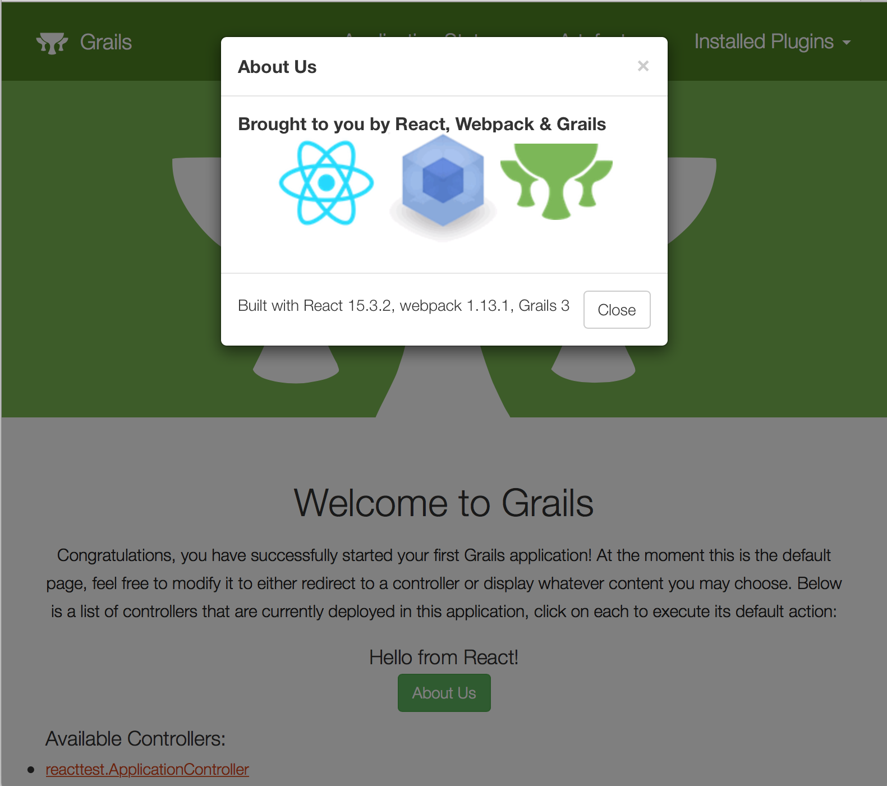

title: Introducing the React Profile for Grails®
date: November 14, 2016  
description: Learn about Grails® React profiles, one aimed at monolithic Grails applications, and a second profile which generates a multi-project client/server structure.
author: Zachary Klein
image: 2016-11-14.jpg   
---

# [%title]

[%author]

[%date] 

Tags: #react

## React Profiles for the Grails&reg; framework

Grails 3 offers great support for the Angular framework, including the Angular Scaffolding plugin as well as profiles for both Angular 1.x and 2.x. Recently new profiles have been released to provide support for creating React applications with Grails 3.

This post will cover *two new profiles for React*, one aimed at monolithic Grails applications, and a second profile which makes use of the brand new [`create-react-app` CLI](https://github.com/facebookincubator/create-react-app) and generates a multi-project client/server structure.

## React & Webpack Profiles

If you've read the previous post on [Using React with the Grails framework](https://grails.org/blog/2016-05-28.html), you've probably noticed that there's quite a bit of wiring that has to happen to get React working properly in the context of a Grails application. This is a place where profiles shine, and now you can get an entire React/Grails project setup immediately upon app generation, including some basic sample React code.

    grails create-app myReactApp --profile=org.grails.profiles:react:1.0.2

The `react:1.x` profile is based on another new profile, `org.grails.profiles:webpack:1.x`.  The `webpack` profile can be used standalone as well, if you want to use webpack with another JavaScript framework in a Grails project. In addition, the `webpack` profile offers a single feature which will configure the `babel` transpiler with support for ES6 - it also includes sample code to demonstrate the feature.

    grails create-app myWebpackApp --profile=org.grails.profiles:webpack:1.0.2 --features=babel

Both the `webpack` and `react:1.x` profiles will expect the JavaScript source files to be kept under `/src/main/webapp`. You can simply start up your app, and webpack will run automatically and bundle the JavaScript into the Grails asset pipeline.  Custom Gradle tasks such as `bundle` (to generate the webpack bundle on app startup) and `webpack` (to run webpack in "watch" mode and reload any changes) are defined. You may also run the corresponding npm scripts if you have npm installed (scripts are defined in `package.json`).

For instance, you can run webpack alongside your Grails app with this command:

    ./gradlew webpack //or: npm run webpack

Now when you make changes to your JavaScript/React code under `/src/main/webapp`, webpack will automatically regenerate the bundle. Just refresh your page to see the changes.

In addition, the `react` profile adds a `mochaTest` task which will run React tests with the mocha test runner. Test sources are kept under `/src/test/js`, and a simple test is provided. Simply run:

    ./gradlew mochaTest //or: npm test

## React Profile - Multi-Project Edition

The react profile is being released with two branches, currently `1.0.2` and `2.0.1`. 

The `react:2.0.1` profile is complete rewrite of the 1.x version, and it leverages the new React CLI from Facebook, `create-react-app`. For more information on the features provided by `create-react-app`, please read the [documentation on Github](https://github.com/facebookincubator/create-react-app). 

In short, `create-react-app` provides us with a complete webpack/React project, with custom scripts defined to build, run and test our React app. It is designed for standalone React apps, which makes it a perfect choice for a client/frontend application backed by a separate server application. That is exactly what `react:2.0.1` provides.

Please note that `react:2.0.1` depends upon the new CORS support in Grails 3.2.1, so you will need to be using that version of Grails or newer.

To get started with this profile, specify it when generating your app:

    grails create-app myReactMultiApp --profile=org.grails.profiles:react:2.0.1

Take a look at the directory structure - you will see a typical Gradle multi-project build, with separate client and server projects.

    -rw-r--r--  1 zak  staff    65 Nov  1 13:10 build.gradle
    drwxr-xr-x  9 zak  staff   306 Nov  1 13:15 client
    drwxr-xr-x  3 zak  staff   102 Nov  1 13:10 gradle
    -rwxr--r--  1 zak  staff  4971 Nov  1 13:10 gradlew
    -rwxr--r--  1 zak  staff  2314 Nov  1 13:10 gradlew.bat
    drwxr-xr-x  8 zak  staff   272 Nov  1 13:12 server
    -rw-r--r--  1 zak  staff    26 Nov  1 13:10 settings.gradle

`server` is of course our Grails application. The profile will generate a Grails app using the `rest-api` profile, which provides support for creating domain classes as restful resources as well as JSON and Markup views.

`client` is our React app. It has been rewritten with React-Bootstrap (Bootstrap 3) and will connect with `server` via REST calls - it has no Grails dependencies of any kind.

    -rw-r--r--   1 zak  staff  44412 Nov  1 13:10 README.md
    -rw-r--r--   1 zak  staff    669 Nov  1 13:10 build.gradle
    -rw-r--r--   1 zak  staff    404 Nov  1 13:10 package.json
    drwxr-xr-x   4 zak  staff    136 Nov  1 13:10 public
    drwxr-xr-x  10 zak  staff    340 Nov  1 13:10 src

This project structure (with the exception of `build.gradle`, which is specific to the `react:2.0.1` profile) is all courtesy of `create-react-app`, and includes an excellent `README` file. In short, the `src/` directory is where the React code is kept, `public/` is for public resources that you wish to make available from your React app without going through webpack's bundling - this directory also includes a template `index.html` file which is used to generate the React app's home page.  Again, see the `create-react-app` documentation for more details.

One significant customization of the `client` project (besides the Grails-branded UI) is the file `src/config.js`. This file is used to specify the URL of the backend, by default `http://localhost:8080`. It also obtains the current version of the React app from 'package.json'.

As with the 1.x version of the `react` profile, this profile define custom Gradle tasks, including a `bootRun` task to startup the client app. You can either start up the `server` and `client` apps separately:

    ./gradlew server:bootRun

    //in another terminal
    ./gradlew client:bootRun

Or you can take advantage of Gradle's parallel execution to run both client and server apps in a single command:

    ./gradlew bootRun -parallel

Other tasks defined in `client` wrap the `create-react-app` scripts for building and testing the React app. You can run them with the Gradle wrapper, or run the npm scripts directly if you have npm installed.

    ./gradlew client:test //or, from the client project dir: npm test

    ./gradlew client:build //or, from the client project dir: npm run build

Again, please see the `create-react-app` documentation for more information on leveraging these scripts and the other features provided by `create-react-app`.

## Wrap-Up

These two profiles offer two ways to use React in the context of a Grails application. If you want to use React within your existing Grails application, either to render components on a GSP or to replace some or all of your GSP pages, then use `react:1.0.1` (or the latest version of the 1.x branch).

If you prefer a completely separate frontend for your Grails application, and/or want to take advantage of the features of the `create-react-app` CLI, then the `react:2.0.1` (or latest version of the 2.x branch) is made for you.

Whichever one you choose, here's hoping these profiles help you enjoy using React with Grails 3!

## Links

 - `create-react-app`: [https://github.com/facebookincubator/create-react-app](https://github.com/facebookincubator/create-react-app)
 - "Using React with the Grails framework": [https://grails.org/blog/2016-05-28.html](https://grails.org/blog/2016-05-28.html)
