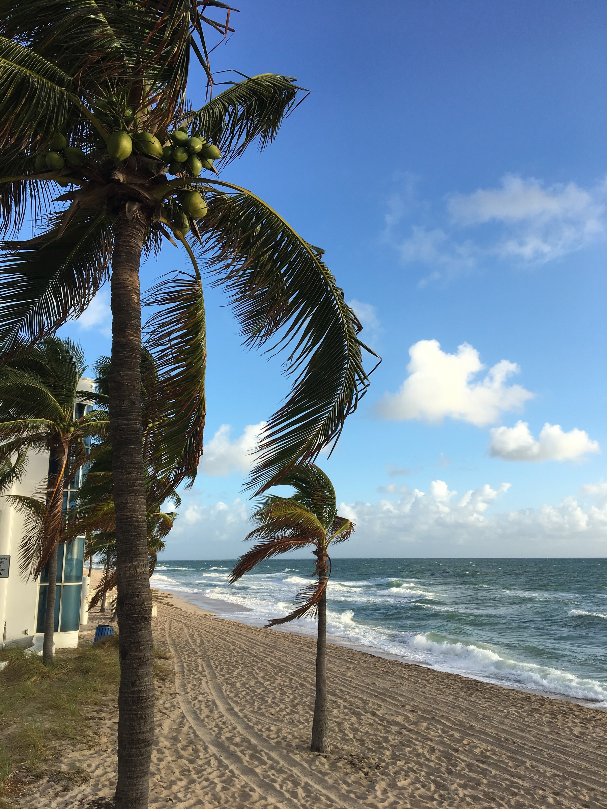
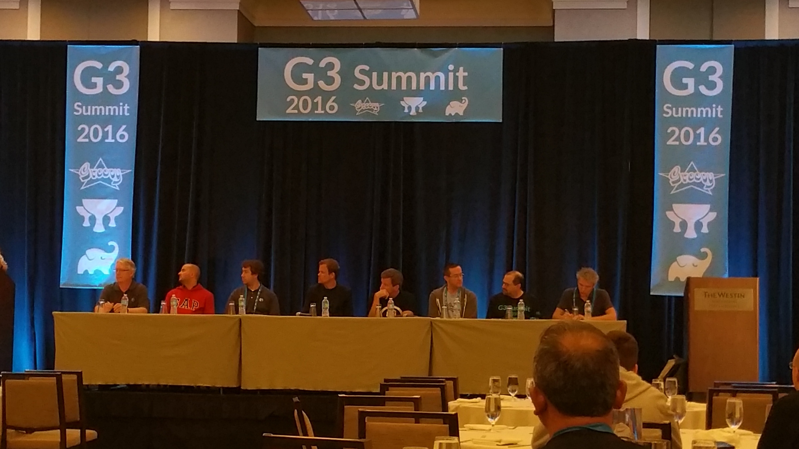
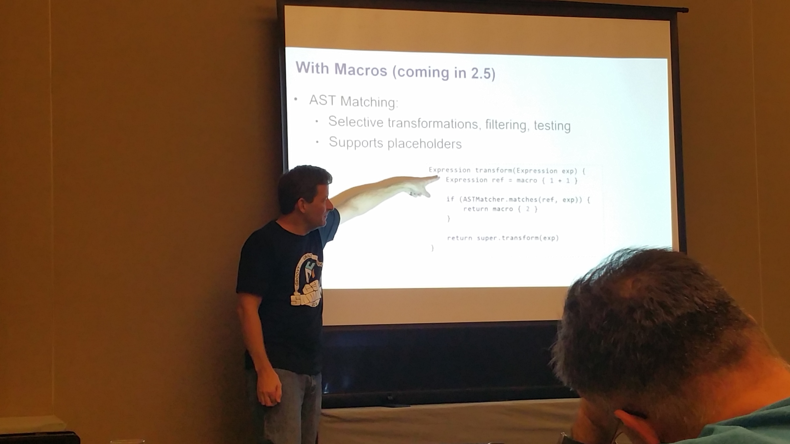

title: G3 Summit 2016 Wrap-up!
date: December 14, 2016  
description: G3 Summit 2016 Wrap-up!
author: Will Buck, Ryan Vanderwerf, Zachary Klein, and Søren Berg Glasius
image: 2016-12-14.jpg   
---

# [%title]

[%author]

[%date] 

Last month, nearly the entire [2GM (Groovy, Grails, and Micronaut) team](https://objectcomputing.com/products/2gm-team) from [Object Computing, Inc.] (https://objectcomputing.com/) (OCI) converged on Fort Lauderdale for the inaugural edition of the [G3 Summit](http://g3summit.com/), the conference for the Apache Groovy, Grails, and Gradle Community. The event is organized by [No Fluff Just Stuff](https://www.nofluffjuststuff.com/home/main) and is a fantastic opportunity for developers to mingle with committers, authors, and project leaders in the greater Groovy community. 

OCI team members presented over 30 workshops and breakout sessions during the event, in addition to socializing with attendees between sessions and after hours. We’ve asked a few team members to share their experiences at the conference. We hope you will join us next year!

## Will Buck, Software Engineer

For me, the inaugural G3 Summit was a hit! The Groovy community is always great to get together with and this event was no exception. I thought the Westin Beach in Fort Lauderdale was a fantastic venue with great food, the keynotes were all exciting and informative, and the presentation blocks were all packed with quality information that got me fired up to try things out on personal and work projects.

Highlights of the event for me were:

* [Iván Lopez](https://g3summit.com/conference/fort_lauderdale/2016/11/session?id=36973)[’s session on Docker](https://g3summit.com/conference/fort_lauderdale/2016/11/session?id=36973), which had an amazingly well put together sample project that he did a great job touring in his presentation
* [Jack Frosch](https://g3summit.com/conference/fort_lauderdale/2016/11/session?id=37329)[’s session on microservices](https://g3summit.com/conference/fort_lauderdale/2016/11/session?id=37329), which also had a wonderful sample project out on github and really helped me "put the pieces together" on Netflix’s OSS in this space (Zuul, Eureka, and Hystrics)
* [Groovy Puzzlers](https://twitter.com/groovypuzzlers) (my first time getting to attend one, hilarious "technical" comedy routine)
* Magician Michael Carducci making James Kleeh’s ring disappear during his magic routine at the closing happy hour
* [The Single-Page Application "breakout" session](https://g3summit.com/conference/fort_lauderdale/2016/11/session?id=38112) on Tuesday, which was a great discussion of real problems attendees were having in their workplaces and ways we’d collectively found to solve them. This in particular was huge for me, as a big reason I joined the OCI Grails team was to hear from OSS users and think about ways I could contribute to solutions that anyone could enjoy
* **Swimming in the Atlantic** after the conference ended, which I don’t think I’ve ever done
* The mealtime conversations about getting Grails into the workplace, personal stories about life as a software developer, and children’s fascination with Villains (I found another kindred spirit whose daughter wants to be Darth Vader!)

Jay Zimmerman and the NFJS tour crew have the kinks worked out on throwing a great conference event and G3 Summit was no exception. I’d highly recommend this to both regulars of the Groovy community and newcomers interested in learning all the great things in our ecosystem!

## Søren Glasius, Software Engineer

This first edition of the G3 Summit was a blast. When traveling to a conference from winter cold Denmark, going to Florida was great. 

I arrived early and had a chance to cruise with Ívan and Álvaro from the OCI Grails Team in a [yellow Ford Mustang Convertible](https://twitter.com/ilopmar/status/802889186906808320). 

But it wasn't all fun and games. The conference was a four-day show of Groovy-ness. The first day was packed with workshops where the attendees had a chance to get in depth knowledge on their favorite G* technology. 

Tuesday kicked off with an insightful keynote by **Guillaume Laforge** covering the current state of [Apache Groovy](http://groovy-lang.org/), followed by Graeme Rocher showing the [new Grails Guides portal](http://guides.grails.org/) and the new [Grails Application Forge](http://start.grails.org/#/index). The keynotes were followed by great talks throughout the day.

On Wednesday I gave two talks: "[Get to Know Grails](https://www.youtube.com/watch?v=ZXRklokhxuE)" and "[Tour de Plugin](https://www.youtube.com/watch?v=RuK90qD6RJU)," and on Thursday I gave a talk named "[Fields Plugin - Deep Dive](https://www.youtube.com/watch?v=T0sxNY1_GFg)" (see links for screencasts).

My personal favorite experience was when sat down and talked to a (former?) Ruby on Rails developer, who wanted to start using Grails in his projects. To see the smile on his face when he saw Grails shine and when he realized that the journey from Rails to Grails would be much easier than he had anticipated.

For me, G3 Summit was well worth the travel from Europe. Thank you to Jay Zimmerman for inviting me to the show, and to his crew who did a great job putting on a great show. I look forward to next year’s edition of G3 Summit.

## Zachary Klein, Software Engineer

The inaugural G3 Summit was a unique and amazing event. The NFJS crew know how to put together a **first-class conference**, and this was no exception. The speaker line-up was very strong, and from the first workshops till the closing sessions there was no shortage of high-quality content. 

Highlights for me would be:

- Venkat Subramaniam’s "[Programming Groovy with Java 8](https://g3summit.com/conference/fort_lauderdale/2016/11/session?id=37328)" and “[Functional Programming for Groovy Programmers](https://g3summit.com/conference/fort_lauderdale/2016/11/session?id=37278)”
- Presentations from my OCI colleagues
    - James Kleeh. (“[Angular Scaffolding](https://g3summit.com/conference/fort_lauderdale/2016/11/session?id=36851)” and “[Creating Custom Profiles](https://g3summit.com/conference/fort_lauderdale/2016/11/session?id=37336)”)
    - Jack Frosch. “[Building a Microservice Federation](https://g3summit.com/conference/fort_lauderdale/2016/11/session?id=37329)”.

The two "all-star" panel discussions were lively and informative, with a wide-range of topics ranging from the future of Groovy/Grails/Gradle to how we as developers can improve our skills and stay abreast of the new developments in our field. Last but not least, the interactions between sessions with attendees and speakers were a fresh and welcome reminder of the strength and welcoming nature of the Groovy community – you’re all a great bunch of folks to work with!

## Ryan Vanderwerf, Software Engineer

SpringOne2GX has turned into G3 Summit! Groovy, Grails and Gradle represent the largest base of G(Groovy)-based tech in the space, but there are so many other projects that are also popular. Jay Zimmerman kicked this one off with his extreme professionalism as all of his NFJS conferences with perfect execution. I was glad to see many new and many familiar faces this year. The venue was nice and right on the beach! 

Things were small and friendly which allowed open conversations with everyone at the two mixers/happy hours on the roof top. I stuck my head in on workshop day in all of the rooms, they were very well attended, especially for 7 hour workshops! 

I spent most of my time at Dan Wood’s [Ratpack](https://ratpack.io/) workshop. He started off in Java for the first few lessons then went improvisational by switching things to Groovy on the fly. I am sure it was way less typing - but in doing things in Java he removed some magic so you would see what is really going on with the framework. I enjoyed it and learned new things! 

That night were was a great kick-off keynote by Venkat Subramaniam and a cocktail reception afterwards.

On Tuesday the conference was in full swing, with Guillaume Laforge giving a great opening keynote, and Graeme Rocher following up with all of the new and exciting things coming from the Grails team and community. They include:

- The [Grails Application Forge](http://start.grails.org/#/index)
- Work towards a micro-service profile
- New profile support for Angular and React
- Plans for Grails 3.3
- Many GORM improvements

The day followed with 90 minute sessions by:

- Paul King ("Groovy - the Awesome Parts")
- Jeff Scott Brown (“Runtime Metaprogramming”)
- Ken Kousen (Grails 3 workshop)
- Ivan Lopez (“Dockerize your Grails!”)
- Raju Gandi (“Gradle from The Ground Up”)

After lunch more sessions by:

- Venkat Subramaniam ("Java 8 and Groovy")
- Guillaume Laforge (“What Can You Learn from [Groovy source files on Github](http://glaforge.appspot.com/article/analyzing-gradle-grails-and-apache-groovy-source-code-hosted-on-github-with-bigquery)”)
- Alvaro Sanchez-Mariscal (“Mastering Grails 3 Plugins”)
- Jeff Scott Brown (“Testing Grails 3”)
- Gary Hale (“Gradle Worse Practices”)

Plus a Grails Roadmap Q&A session by Graeme Rocher 

The OCI Grails team organized several informal Q&A sessions throughout the day where people could come and go and ask more detailed questions that wouldn’t fit during a talk. Lots of interesting people came and voiced their opinions, asked for advice, and shared what they were doing or wanted to do.

Finishing the day was:

- "GORM Inside and Out" by Graeme Rocher
- Paul King with a “Deep Dive into AST Transforms”
- Jeff Scott Brown with “Grails 3 for Spring Boot Developers”
- James Kleeh with “Angular Scaffolding”
- Jon Schneider with "Distributed Refactoring at [Netflix](https://www.netflix.com/)”

That slot was hard for me to choose because I hadn’t seen most of them before; I went to Paul's AST talk, which did not disappoint.

Tuesday wrapped up with a keynote by Gradle founder and CEO Hans Dockter, in which he announced many new features around wrangling dependencies, such as substitution and  replacement. After that was a panel discussion and audience Q&A.

On Wednesday the conference got going full force with great talks by:

- Jack Frosch sharing Java to Groovy experiences
- David Clark with high-performance Groovy
- Søren Glasius with "Get to Know Grails"
- James Kleeh with “Creating Custom Profiles”
- Ken Kousen on “Gradle Recipes for Android” 

I attended James Kleeh’s talk on custom profiles, which had a lot of good information he put together and documented while building the Angular profiles.

Next up was:

- Dan Wood with an "Intro to Ratpack"
- Venkat with “Typing in Groovy”
- Jeff Scott Brown with “Monitoring and Metrics for Grails”
- Jack Frosch with “Building a Microservice Federation”
- Chip Dickson and Charles Walker doing a joint talk on “Gradle Migration Blueprints”

After lunch we had:

- David Clark on “Modern Groovy DSLs”
- Venkat on Spock
- Jeff Scott Brown on “Restful Grails 3”
- Alvaro on “Grails, Angular and Spring Security”
- Ethan Hall on Linkedin usage of Gradle
- and yet another informational Q&A Session with SPA (I hung out there to learn myself!)

The talks just keep on coming all the way until 6:30 - this is a marathon! 

Next slot is:

- Dan Woods with "Groovy in the Cloud"
- Ivan Lopez with Groovy Annotations
- Jeff Scott Brown with “Polyglot Development with Grails”
- Zachary Klein with “Using React and Grails 3”
- Scott Hickey with Mutual of Omaha and Jenkins
- A GORM Q&A Session. 

Last slot of talks I gave a new version of my “Alexa Tell my I’m Groovy” where I shared all of the latest efforts my friend Lee Fox and I did with overhaul of the Java SDK which the Grails Plugin and Lazybones Lambda use to make Skills quickly. I demoed the various types of apps/Skills you can make and shared how I made them. 

David Clark had a “Concurrent Groovy” talk at the same time, Colin Harrington had a talk on “Grails View Layer”, Søren Glasius on “Tour de Plugin”, Zak Klein and Will Buck on “Grails, Gradle and Node.js”, and Grails 3.2 Q&A session. 

We wrapped up with a great great “Groovy Puzzlers” Season 3 session with Baruch Sadorgursky and Guillaume Laforge, and finally another nice cocktail reception!

The last day ended a bit slow, with breakfast and panel discussion, followed by a single slot of sessions. 

I gave my talk "Getting Groovy with Google Glass and Android Wear" - by this time it seems most people went home. However, those who came participated in a great discussion about Glass, Wear, modifying cars, and home automation, which I enjoyed. 

Venkat gave a Functional Programming talk, Ken a talk on functional testing with Geb, Søren a talk on [the Fields plugin](https://grails.org/plugin/fields), Michael Carducci with CI on Gradle/Jenkins, and Jeff held a Grails Upgrade Q&A Session. 

We finished up the conference with lunch, which was a nice touch at the end I don’t normally see at conferences!

Overall it was a great conference and would love to see even more attendance next year. I think the 90 minute format is great for a deeper dive into the tech instead of a overview at 60 minutes. The venue is great for nice weather and folks up north getting a break from the cold.

The last night several teammates went out for Cuban food, which was delicious! On Friday Ivan, Alvaro and I walked around the marina areas and had a nice Italian lunch before hopping on a plane back to Austin.

I hope to see everyone and more new faces next year!!!