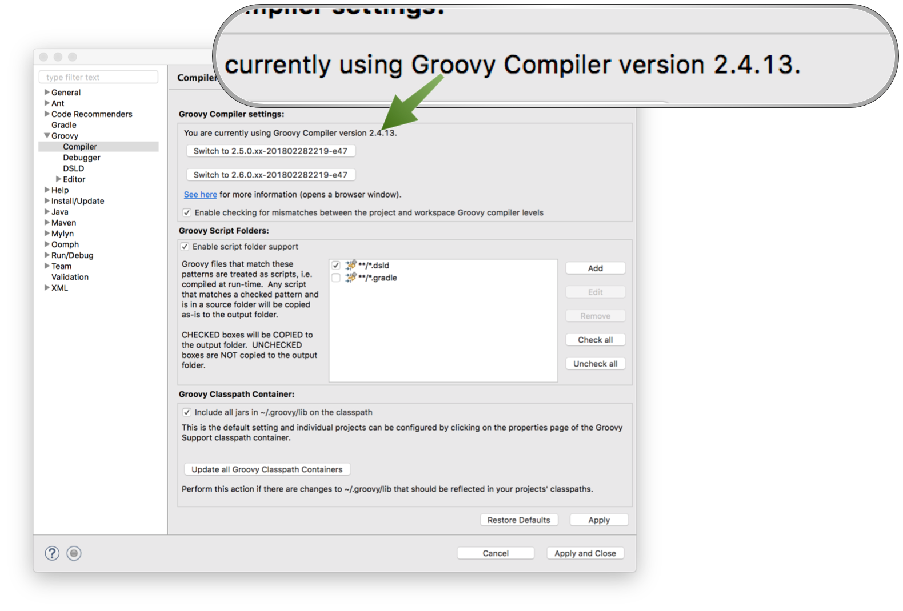
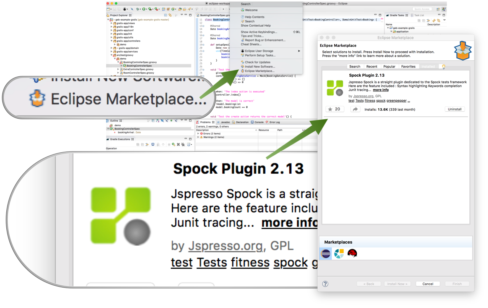
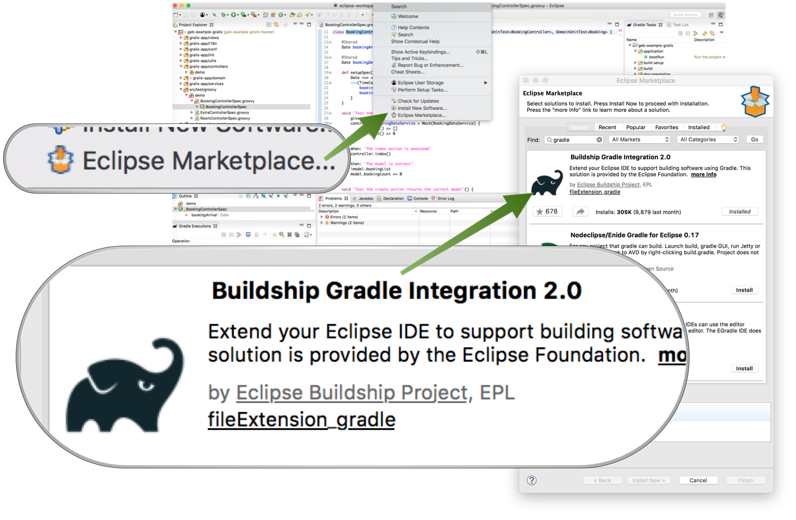
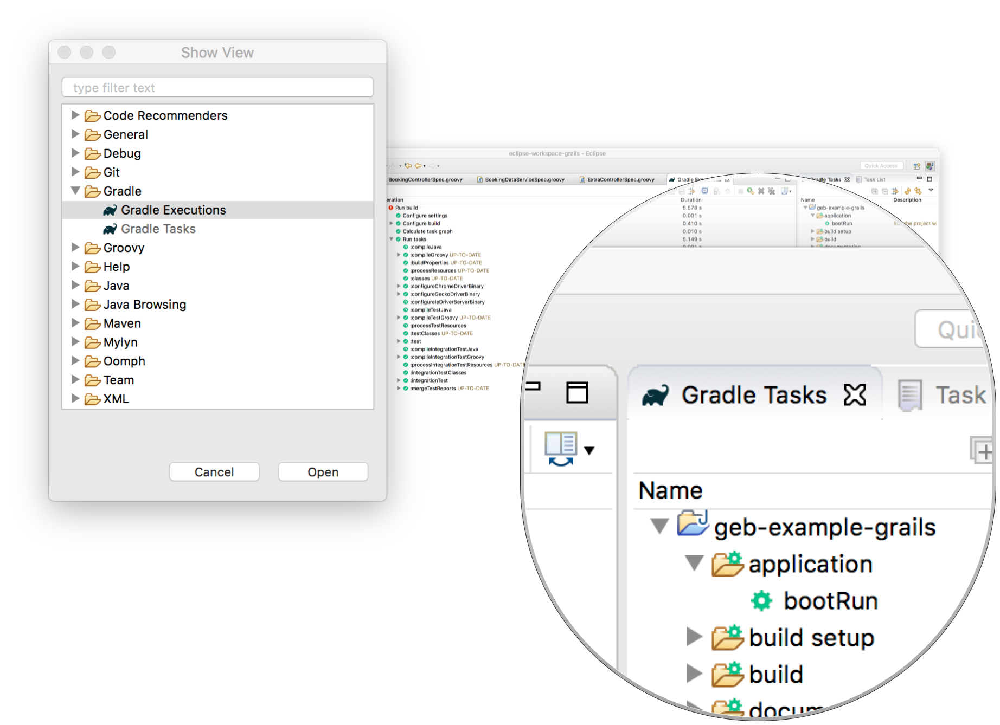

title: Grails® Development with Groovy Eclipse
date: March 2, 2018  
description: By leveraging Gradle capabilities, it is possible to develop Grails® applications with Eclipse IDE.
author: Sergio Del Amo Caballero
image: 2018-03-02.jpg    
CSS: [%url]/stylesheets/prism.css
JAVASCRIPT: [%url]/javascripts/prism.js
---

# [%title]

[%author]

[%date] 

Tags: #groovy #eclipse #gradle

In this blog post, we show the steps necessary to set up [Eclipse IDE](https://www.eclipse.org) to develop Grails<sup>&reg;</sup> 3 applications.

## Groovy Eclipse

First step is to install [Groovy Eclipse](https://github.com/groovy/groovy-eclipse). Check the [installation instructions](https://github.com/groovy/groovy-eclipse/wiki#how-to-install). 

Once, you have set up Groovy Eclipse, set up the compiler to use Groovy 2.4.13; the version used by the latest stable release of Grails 3.3.2.

 

## Eclipse Spock Plugin

Install [Eclipse Spock Plugin](https://marketplace.eclipse.org/content/spock-plugin)



## Buildship Gradle Plugin

Install [Buildship Gradle plugin](https://projects.eclipse.org/projects/tools.buildship). 



We are going to rely on Gradle tasks to drive our Grails development in Eclipse. Thus, you may want to enable Gradle views.
 

 
## Gradle Tips

When you work often with Gradle it becomes useful to get a verbose output while you run your tests:
 
```groovy
tasks.withType(Test) {
      beforeTest { descriptor -> logger.quiet " -- $descriptor" }
     testLogging {
         events "passed", "skipped", "failed"
         exceptionFormat 'full'
     }
 }
``` 

### Common Grails Gradle Tasks

Run your app 

`./gradlew bootRun`


Run unit tests 
 
`./gradlew test`


Run integration/functional tests 

`./gradlew integrationTest`


Run ALL tests unit/integration/functional 

`./gradlew check`


Clean
 
`./gradlew clean`


Build your artifacts
 
`./gradlew assemble`


Dependency report
 
`./gradlew dependencies`
