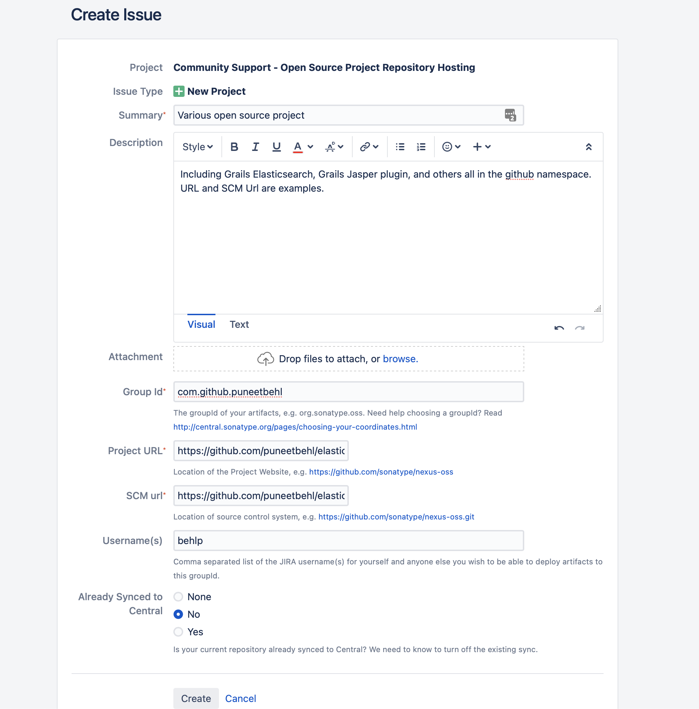

# [%title]

[%author]

[%date]

Tags: #bintray #plugins

Beginning May 1, 2021, you will [no longer be able to publish your Grails plugins/artifacts to JFrog Bintray](https://grails.org/blog/2021-02-12-alerts-regarding-bintray-sunset.html). We have already copied most of the Grails plugins from JFrog Bintray to the [Grails Artifactory](https://repo.grails.org), which allows us to resolve those artifacts. Going forward, we recommend that you start publishing artifacts to Maven Central.

In this post, we outline how to publish Grails plugins to Maven Central. For detailed information, we also suggest checking [Sonatype OSSRH Guide](https://central.sonatype.org/publish/publish-guide/).

The Sonatype’s OSSRH service is the primary place to publish plugins to the Central repository. In order to use OSSRH, you need to take care of a few prerequisites and follow some basic steps.

## Prerequisites

1. ### Choose your coordinates

    When publishing Grails plugins to Bintray, it was possible to publish under the same groupId (org.grails.plugins).
    
    To publish to Sonatype, the groupID needs to be changed.

    1. If your plugins are hosted on GitHub, you could use "io.github.yourusername", "io.github.yourorganization", etc. For example: "io.github.puneetbehl", where "puneetbehl" is my GitHub username.
    2. If you own or manage a domain then you could use groupId starting with the reverse domain name.

   Please note that there is a Sonatype validation process to verify that you own the GitHub username or control the domain. See [Individual Projects - Open Source Software Repository Hosting (OSSRH)](https://central.sonatype.org/publish/#individual-projects-open-source-software-repository-hosting-ossrh) for more information.

2. ### Sign up and provide project details

   Once you identify a groupId, claim your namespace on the central repository.

   1. Sign up on [Sonatype JIRA](https://issues.sonatype.org/secure/Signup!default.jspa).
   2. Provide project details by creating a new project ticket.
      1. Create a new Issue in the "Community Support - Open Source Project Repository Hosting" project.
      2. The issue type should be "New Project".
      3. On the Project Details page, enter basic project details. See the screenshot below for an example:
         
         **NOTE:** Once the ticket is resolved, you should be good to deploy your artifacts.
         
3. ### Make sure your project meets the minimum requirements
   When publishing to the central repository, your project must meet a basic set of metadata and content requirements. Even though metadata will be generated with Gradle plugins, it is useful to understand it.

   1. #### Javadoc and Sources
      Verify that your plugin supplies javadoc and sources. For example, if your plugin name is myplugin then it should also package "myplugin-1.0.0-sources.jar" and "myplugin-1.0.0-javadoc.jar".

   2. #### Sign Files with GnuPG/PGP
      All files must be signed with GnuPG/PGP, and an ".asc" file containing the signature must be included for each file. For example, when you deploy, the following files must be included:
       - myplugin-1.0.0.pom
       - myplugin-1.0.0.jar
       - myplugin-1.0.0-sources.jar
       - myplugin-1.0.0-javadoc.jar
       - myplugin-1.0.0.pom.asc
       - myplugin-1.0.0.jar.asc
       - myplugin-1.0.0-sources.jar.asc
       - myplugin-1.0.0-javadoc.jar.asc
       
   3. #### Metadata
      Ensure that the POM file contains the following metadata:
      - Project coordinates - groupId, artifactId, version
      - Project name, description, and URL
      - Declare license
      - Developer information
      - SCM information
      
      You can refer to the [Sonatype Requirements](https://central.sonatype.org/publish/requirements/) page for more information.

   4. #### Install GnuPG, and Distribute Your Public Key
      One of the requirements for publishing to the central repository is to sign your artifacts using GnuPG. To install it, please read the instructions [here](https://central.sonatype.org/publish/requirements/gpg/).

      After generating the GnuPG key, distribute your public key to the key server so others can use it to verify your files. See [Distributing Your Public Key Section](https://central.sonatype.org/publish/requirements/gpg/#distributing-your-public-key).

      You may receive an error from Sonatype stating that the signature could not be verified.  The error message will list the key servers that it is checking. You may need to distribute your key to another server (for example: http://keyserver.ubuntu.com:11371) in order for Sonatype to validate the artifacts.

## Publishing

In order to deploy your plugin artifacts to OSSRH, you must meet the requirements for metadata in the POM and sign the artifacts. But first, let’s remove the previous Grails plugin, which was used to upload artifacts to JFrog Bintray.

The previous Grails plugin is configured with "grails-plugin-publish", which uses a Gradle Bintray plugin to upload artifacts.

Delete the following lines from your project build.gradle file to remove the plugin:

```groovy
apply plugin:"org.grails.grails-plugin-publish"

grailsPublish {
   user = 'user'
   key = 'key'
   githubSlug = 'foo/bar'
   license {
       name = 'Apache-2.0'
   }
   title = "My Plugin"
   desc = "Full plugin description"
   developers = [johndoe:"John Doe"]
}
```

1. ### Generating Metadata
   Use the Gradle [maven-publish](https://docs.gradle.org/current/userguide/publishing_maven.html) plugin to generate the necessary metadata, and deploy artifacts to the repository.

   1. Apply the Maven Publish plugin

      ```groovy
      apply plugin: 'maven-publish'
      ```
   
   2. Customize Metadata - The following sample shows how to customize the metadata for a Grails plugin:

      ```groovy
      group 'io.github.puneetbehl'
      Version '1.0.0'
      
      publishing {
         publications {
             maven(MavenPublication) {
                 groupId = project.group
                 artifactId = 'my-plugin'
                 version = project.version
      
                 from components.java
                 artifact sourcesJar
                 artifact javadocJar
      
                 pom {
                     name = 'My Grails Plugin'
                     description = 'A concise description of my library'
                     url = 'https://github.com/puneetbehl/myplugin'
                     licenses {
                         license {
                             name = 'The Apache License, Version 2.0'
                             url = 'https://www.apache.org/licenses/LICENSE-2.0.txt'
                         }
                     }
                     developers {
                         developer {
                             id = 'puneetbehl'
                             name = 'Puneet Behl'
                             email = 'behlp@objectcomputing.com'
                         }
                     }
                     scm {
                         connection = 'scm:git:git://github.com/puneetbehl/myplugin.git'
                         developerConnection = 'scm:git:ssh://github.com:puneetbehl/myplugin.git'
                         url = 'https://github.com/puneetbehl/myplugin/tree/main'
                     }
                 }
             }
         }
      }
      ```
   
2. ### Signing Artifacts
   Use the Gradle [Signing](https://docs.gradle.org/5.0/userguide/signing_plugin.html) plugin to sign the artifacts, including metadata and pom.

   1. Apply the Signing Plugin

      ```groovy
      apply plugin: 'signing'
      ```
      
   2. Provide GnuPG key Information in your build.gradle file.

      ```groovy
      ext."signing.keyId" = project.hasProperty("signing.keyId") ? project.getProperty('signing.keyId') : System.getenv('SIGNING_KEY_ID')
      ext."signing.password" = project.hasProperty("signing.password") ? project.getProperty('signing.password') : System.getenv('SIGNING_PASSPHRASE')
      ext."signing.secretKeyRingFile" = project.hasProperty("signing.secretKeyRingFile") ? project.getProperty('signing.secretKeyRingFile') : (System.getenv('SIGNING_PASSPHRASE')?:"${System.properties['user.home']}${File.separator}.gnupg${File.separator}secring.gpg")
      ```
      
   3. Get Signatory Credentials
      1. Get the public key ID (The last 8 symbols using `gpg -K` command).
      2. Export the keys with command `gpg -keyring secring.gpg --export-secret-keys > ~/.gnupg/secring.gpg`.
      3. Know the Passphrase used to protect private keys.
    
   4. Export the following environment variables
      1. `SIGNING_KEY_ID` - The public key ID.
      2. `SIGNING_PASSPHRASE` - The passphrase used while generating GnuPG key.
      3. `SECRING_FILE` - The path to secring.gpg file.
    
   5. Sign the artifacts and also prevent signing snapshots by adding required check as follows:

      ```groovy
      ext.isReleaseVersion = !version.endsWith("SNAPSHOT")
      
      afterEvaluate {
         signing {
             required { isReleaseVersion && gradle.taskGraph.hasTask("publish") }
             sign publishing.publications.maven
         }
      }
      
      tasks.withType(Sign) {
         onlyIf { isReleaseVersion }
      }
      ```
   
3. ### Configuring A Multi-Project Build
   In case of multi-project builds, you need to configure plugins to generate metadata and signing for each of the sub-projects. The easiest way to achieve this is:

      ```groovy
      subprojects { project ->
          // your code here
      }
      
      ```
   
4. ### Publish Your Artifacts to OSSRH, followed by release to Maven Central
   The [Gradle Nexus Publish Plugin](https://plugins.gradle.org/plugin/io.github.gradle-nexus.publish-plugin) is used to publish your artifacts to Sonatype and then to Maven Central in a fully automated way. Check the plugin [README](https://github.com/gradle-nexus/publish-plugin) for more information.
    
    1. Applying the plugin

         ```groovy
         buildscript {
            repositories {
                maven { url "https://repo.grails.org/grails/core" }
                maven { url "https://plugins.gradle.org/m2/" }
            }
            dependencies {
                classpath "org.grails:grails-gradle-plugin:$grailsVersion"
                classpath "com.bertramlabs.plugins:asset-pipeline-gradle:3.0.10"
                classpath "io.github.gradle-nexus:publish-plugin:1.0.0"
            }
         }
         
         
         apply plugin: 'maven-publish'
         apply plugin: 'signing'
         apply plugin: "io.github.gradle-nexus.publish-plugin"
         ```
    
    2. To publish to Maven Central via Sonatype OSSRH, add the Sonatype repository as follows:

         ```groovy
         nexusPublishing {
            repositories {
                sonatype {
                    def ossUser = System.getenv("SONATYPE_USERNAME") ?: project.hasProperty("sonatypeOssUsername") ? project.sonatypeOssUsername : ''
                    def ossPass = System.getenv("SONATYPE_PASSWORD") ?: project.hasProperty("sonatypeOssPassword") ? project.sonatypeOssPassword : ''
                    def ossStagingProfileId = System.getenv("SONATYPE_STAGING_PROFILE_ID") ?: project.hasProperty("sonatypeOssStagingProfileId") ? project.sonatypeOssStagingProfileId : ''
                    nexusUrl = uri("https://s01.oss.sonatype.org/service/local/")
                    snapshotRepositoryUrl = uri("https://s01.oss.sonatype.org/content/repositories/snapshots/")
                    username = ossUser
                    password = ossPass
                    stagingProfileId = ossStagingProfileId
                }
            }
         }
         ```
       
         Please note that in case of a multi project build, you must add the configuration from steps 1 and 2 under the root project.
   
    3. Retrieve the Sonatype Staging Profile ID
         1. Log in to [https://s01.oss.sonatype.org/](https://s01.oss.sonatype.org/) using your Sonatype credentials.
         2. Select "Staging Profiles" under the "Build Promotions" section in the left navigation panel.
         3. Select the Staging Profile with name as the groupId value.
         4. Copy the last part in your browser URL which is the Staging Profile ID. For example, when the browser URL is https://s01.oss.sonatype.org/#stagingProfiles;ce7c8eca12345 then profile id is "ce7c8eca12345" (the portion after semicolon).
       
   4. Export the following environment variables:
         1. SONATYPE_USERNAME - Your sonatype username
         2. SONATYPE_PASSWORD - Your sonatype password
         3. SONATYPE_STAGING_PROFILE_ID - The Staging Profile ID copied in the previous step
   
   5. Publish artifacts to the new staging repository and verify them manually.

         ```groovy
         ./gradlew publishToSonatype closeSonatypeStagingRepository
         ```
         
   6. After verifying, manually drop the staging repository.
         1. Log in to [https://s01.oss.sonatype.org/](https://s01.oss.sonatype.org/)
         2. Click on "Staging Repositories" which is under the Build Promotion section in the left navigation.
         3. Click the checkbox against the repository and select drop.
      
   7. Publish artifacts to the new staging repository and verify them manually.

        ```groovy
        ./gradlew publishToSonatype closeAndReleaseSonatypeStagingRepository
        ```

## Automate Publishing Using GitHub Action

To automatically release using GitHub Workflow, add the following [.github/workflows/release.yml](https://raw.githubusercontent.com/puneetbehl/myplugin/main/.github/workflows/release.yml) workflow configuration file to your project.

When using this file, you must configure the following GitHub Secrets:

1. SONATYPE_USERNAME
2. SONATYPE_PASSWORD
3. SONATYPE_STAGING_PROFILE_ID
4. SIGNING_KEY
5. SIGNING_PASSPHRASE
6. SECRING_FILE - This is a BASE64 encoded value. Run the command `gpg --keyring ~/.gnupg/pubring.kbx --export-secret-keys > ~/.gnupg/secring.gpg && base64 ~/.gnupg/secring.gpg | pbcopy` to copy BASE64 encoded value to the clipboard.

To trigger a release, create a new release from the GitHub releases page. Here is a sample [Grails Plugin](https://github.com/puneetbehl/myplugin) that's configured to publish to Maven Central.

## Update Information on Grails Plugin Portal
The [Grails Plugin Portal](https://plugins.grails.org) uses the [grails-plugins.json](https://raw.githubusercontent.com/grails/grails-plugins-metadata/main/grails-plugins.json) metadata file to display plugin information.

The metadata is hosted at [https://github.com/grails/grails-plugins-metadata/blob/main/grails-plugins.json](https://github.com/grails/grails-plugins-metadata/blob/main/grails-plugins.json). When you publish a new plugin or release an existing plugin, you must send a pull request to this file to update the information on the portal.

1. When you release a new plugin, add the following information at the end of the JSON file:
    ```groovy
    {
        "bintrayPackage": {
            "name": "My Plugin",
            "repo": "plugins",
            "owner": "puneetbehl",
            "desc": "A concise description",
            "labels": [
                    "grails3",
                    "spring-boot",
                    "test-label"
            ],
            "licenses": [
                    "Apache-2.0"
            ],
            "issueTrackerUrl": "https://github.com/puneetbehl/myplugin/issues",
            "latestVersion": "1.1",
            "updated": "2021-03-25T04:00:40.855Z",
            "systemIds": [
                    "io.github.puneetbehl:myplugin"
            ],
            "vcsUrl": "https://github.com/puneetbehl/myplugin"
        }
        "documentationUrl": "https://puneetbehl.github.io/myplugin/",
        "mavenMetadataUrl": "https://repo1.maven.org/maven2/com/github/puneetbehl/myplugin/maven-metadata.xml",
    } 
    ```
    
2. If you publish a new version to Maven Central, locate the entry in the JSON file and updatelatestVersion and mavenMetadataUrl. This will reflect the latest version in the plugin portal. In the future, we will use the mavenMetadataUrl field to automatically update the latest version.
