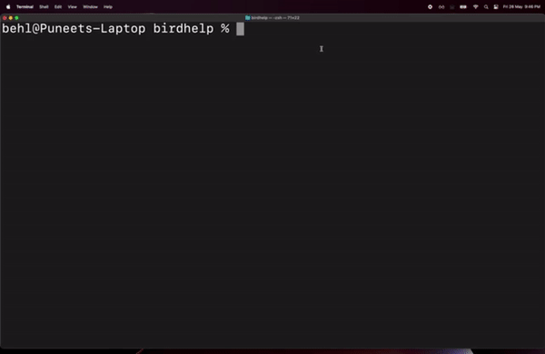

 
# [%title]

[%author]

[%date]
 
The Grails Foundation is pleased to announce the release of Grails 6 RC1! We encourage you to update your applications to this release.

The [Grails 6.0.0-RC1 Release](https://github.com/grails/grails-core/releases/tag/v6.0.0-RC1) provides an easy upgrade path to the developers, or project managers who are looking to upgrade to Java 17, and Spring 6. 

## What’s New? 

- All major Grails libraries such as Grails Views, Grails GSP, Grails Testing Support, GORM core, GORM for Hibernate, MongoDB, and Neo4J are updated to Java 11 as baseline, Gradle 7.6.1. 
- A brand new and superfast [Command Line Interface](https://github.com/grails/grails-forge) to generate Grails 6 applications and plugins. This new CLI provides the ability to generate applications completely offline. 

## Installation

### Installing with SDKMan

The easiest way to install the new Grails CLI is with SDKMan, run the following command:

```
sdk install grails 6.0.0-RC1
```

### Download & Install Binary

- Download the latest binary from [here](https://github.com/grails/grails-forge/releases/tag/v6.0.0-RC1) based on your Operating System
- Extract to appropriate directory.
- Create environment variable GRAILS_HOME which points to installation directory, eg: c:/grails
- Update the PATH environment variable, append %GRAILS_HOME%\bin.

### Use SDKMan To Build & Install From Source
 
- Clone the repository as follows:
- git clone [github.com/grails/grails-forge/tree/v6.0.0-RC1](https://github.com/grails/grails-forge/tree/v6.0.0-RC1)
- Build dist using the command `./gradlew :grails-cli:assembleDist`.
- Copy & Extract the archive from grails-forge/grails-cli/build/distributions/grails-cli.*.zip to the user home or any other directory of your preference.
- Use [SDKMan](https://sdkman.io/), to install the dev version and use the path to the extracted directory. For example, the following command install the “dev” version and assumes you’ve extracted to the user’s home directory:
```
sdk install grails dev ~/grails-cli/
sdk use grails dev
```
### Why is my Grails 6 RC1 application not working?

- Starting with the recent release of Grails 6, the CLI has moved to a separate project [github.com/grails/grails-forge](https://github.com/grails/grails-forge). The CLI shipped with Grails Core is deprecated and will be removed in the near term. 

- If you have used Grails binaries before, then you might be used to downloading it from the [Grails Core release page](https://github.com/grails/grails-core/releases/v6.0.0-RC1). However, this will no longer work and you should instead, download the OS specific native image from the [Grails Forge 6.0.0-RC1 Release Page](https://github.com/grails/grails-forge/releases/v6.0.0-RC1).

### Why do some Grails commands don't work?

The New CLI currently supports commands like `create-app`, `create-controller`, `create-service`, etc. You could also enter the Grails CLI interactive mode by entering `grails` and pressing the `return key` for auto-complete of supported commands.



We’ve dropped the support for commands which perform the redundant tasks such as `grails run-app` and we recommend using the Gradle `bootRun` task to run your application. However, we’ll add the support for a few other commands such as `create-service`, `create-test`, etc.

## Grails 4 EOL - Announcement

Grails 4 was released in July 2019. As of March 31, 2023, Grails 4 has reached the end of support. This means Grails version 4.x is unlikely to receive additional updates. 

The Grails Foundation is committed to the continued evolution, development, maintenance, and support of the Grails framework. Our goal is to provide Grails users the support they need while maintaining as much focus as possible on innovation. The level and type of support available for earlier versions of the Grails framework will change as the Framework continues to evolve, and the support team remains available to help regardless of the version of the Grails framework that you are using. Please see some of our support options [here](https://grails.org/support.html). For more information about the level of support available for each version of the Grails framework, please see our [support schedule](https://grails.org/support-schedule.html).

We understand that different organizations have different support needs. With our support options, we can help your team make the most of the features available in the Grails framework and add another layer of protection to the investment in your critical business applications. Please [contact us](https://grails.org/support.html#popup) if you need help supporting your Grails applications.

## Grails Roadmap

- The new Grails Forge website is coming soon!
- More application types will be supported.
- We will be adding more features such as Security.
- The Grails Scaffolding Plugin will be updated to work with Grails 6.

